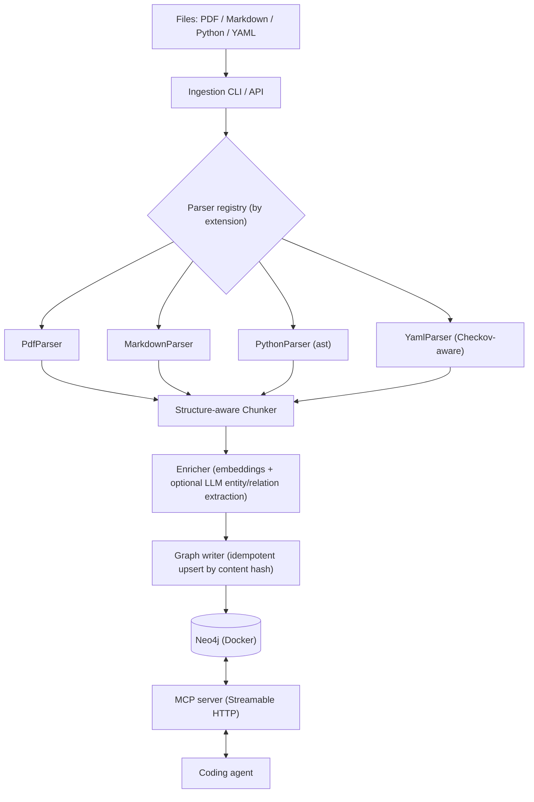

# graph-rag

**A local-first Graph RAG knowledge base for coding agents, served over MCP.**

[](https://github.com/tmustafiz/graph-rag/actions/workflows/ci.yml)
[](LICENSE)
[](pyproject.toml)
[](https://modelcontextprotocol.io)

graph-rag ingests the heterogeneous stuff a coding agent needs to reason about —
service docs (PDF), internal Markdown, your Python source, and YAML policy files
(Checkov) — into a single **Neo4j knowledge graph**, and exposes it to the agent
over an **MCP server**: hybrid (vector + full-text) search, table-of-contents
navigation, exact policy lookup, code-centrality ranking, graph traversal, and
the agent's own **persistent working memory**.

It runs entirely on your machine. The default embedding model is local, so
ingestion needs no API key and works offline.

## Why

Plain vector RAG loses structure: it can't tell you *which section* a chunk came
from, *what calls* a function, or *which policy applies to* `aws_db_instance`.
graph-rag keeps those relationships as graph edges, so an agent can both search
semantically **and** traverse — "find the retry section, then show me its parent
chapter", "rank this codebase's most-depended-upon functions", "give me the
Checkov rules for this resource type". It also gives the agent a place to
`remember` decisions and `recall` them in a later session.

## Demo

<!-- TODO: add an asciinema / GIF of an agent calling search_code + recall -->

## Install

The PyPI package is [`grag-mcp`](https://pypi.org/project/grag-mcp/) (the name
`graph-rag` was taken); it installs a `grag-mcp` command. No clone needed — run
it straight with [`uv`](https://docs.astral.sh/uv/):

```bash
uvx grag-mcp --help                       # one-off, no install
uvx 'grag-mcp[pdf]' serve-mcp --stdio     # with PDF ingestion support
```

or install the `grag-mcp` command onto your PATH:

```bash
uv tool install 'grag-mcp[pdf]'    # or: pipx install 'grag-mcp[pdf]'
```

You still need a Neo4j instance (APOC + GDS plugins) reachable at `NEO4J_URI` /
`NEO4J_USER` / `NEO4J_PASSWORD` — see [docker-compose.yml](docker-compose.yml)
for a ready-made one. The `[pdf]` extra pulls in PyMuPDF (AGPL-licensed); leave
it off if you only ingest Markdown / Python / YAML.

On Linux, pass `--torch-backend=cpu` (`uvx --torch-backend=cpu …`) unless you
want the multi-gigabyte CUDA build of PyTorch — the embedding model runs on CPU.

A prebuilt runtime image (`linux/amd64` + `linux/arm64`, embedding model baked
in) is published on each release:

```bash
docker pull ghcr.io/tmustafiz/graph-rag:latest
```

## Quickstart (from a clone)

Requires [`uv`](https://docs.astral.sh/uv/) and Docker.

```bash
cp .env.example .env        # adjust NEO4J_PASSWORD if you like
make install                # uv sync --all-extras
make fetch-model            # download the local embedding model (~87 MB)
make up                     # start Neo4j (Docker)
make apply-schema           # constraints + full-text + vector indexes
make ingest INGEST_PATH=examples/checkov-policies   # or point at your own docs
make mcp-serve              # MCP server on http://127.0.0.1:8765/mcp
```

graph-rag ships **no document corpus** — you bring the files to ingest.
`examples/` holds a few small samples to try the tooling against; everything
else is yours.

Neo4j Browser: <http://localhost:7474> (`neo4j` / your `NEO4J_PASSWORD`).

Or run everything (Neo4j + MCP server) with Compose:

```bash
docker compose up -d
```

Other targets: `make down`, `make lint`, `make format`, `make test`, `make eval`.

## Connect an agent

The MCP server speaks Streamable HTTP at `http://127.0.0.1:8765/mcp`.
`.mcp.json` at the repo root already registers it for this project.

**Claude Code**

```bash
claude mcp add graph-rag --transport http http://127.0.0.1:8765/mcp
```

**Claude Desktop / Cursor / Windsurf / VS Code** — add to the MCP config:

```json
{
  "mcpServers": {
    "graph-rag": { "type": "http", "url": "http://127.0.0.1:8765/mcp" }
  }
}
```

Set `MCP_AUTH_TOKEN` in `.env` to require a bearer token (defense in depth; the
server is bound to `127.0.0.1` regardless — see [SECURITY.md](SECURITY.md)).

### stdio transport

For clients that launch the server as a subprocess instead of connecting over
HTTP, run `grag-mcp serve-mcp --stdio` — no port, no auth token, no
`POST /ingest`. Point the client's command at it:

```json
{
  "mcpServers": {
    "graph-rag": { "command": "grag-mcp", "args": ["serve-mcp", "--stdio"] }
  }
}
```

Use `uv run grag-mcp …` (or an absolute path to the entry point) as the
`command` if `grag-mcp` isn't on the client's `PATH`. Neo4j still has to be
reachable at `NEO4J_URI`.

## MCP tools

| Tool | What it does |
| --- | --- |
| `search` | Hybrid (vector + full-text) search over ingested prose / Markdown / generic-YAML chunks. Does **not** cover Python code or Checkov policy text. |
| `search_code` | Same hybrid search, over ingested Python functions / classes / modules. |
| `search_policies` | Hybrid search over Checkov policy content — the fuzzy complement to `find_policies_for`. |
| `find_policies_for` | **Exact-match** traversal: policies whose `APPLIES_TO` edge names a Terraform resource type precisely (e.g. `aws_db_instance`). No fuzzy fallback. |
| `get_section` / `get_outline` | Full section text (paginated via `max_chars`) or a source's table-of-contents tree. |
| `list_sources` | Everything currently ingested (also the `graph-rag://sources` MCP **resource**). |
| `get_neighbors` | Walk the graph from any node — Source path, Section/Chunk/PolicyRule/AgentMemory id, CodeEntity qualified name, or Concept name — optionally filtered by relationship type. |
| `get_central_code_entities` | Most-depended-upon code by PageRank over the `CALLS`/`IMPORTS` graph. Empty until `grag-mcp compute-centrality` has run. |
| `cite` | Human-readable citation string for a chunk. |
| `ingest_path` | (Re-)ingest a file or directory from within a session. |
| `remember` / `recall` / `forget` | The agent's own working memory, with recency + frequency decay pruning. |

## Ingesting your own content

`grag-mcp ingest <path>` takes a file or a directory (recursed), parses
whichever of PDF / Markdown / Python / YAML it finds, and upserts into the
graph. Re-running is cheap: a file whose content hash is unchanged since the
last ingest is skipped entirely, and re-ingesting a changed file removes any
Section / Chunk / CodeEntity / PolicyRule it no longer produces.

```bash
uv run grag-mcp ingest src/graph_rag           # this repo's own source
uv run grag-mcp ingest path/to/docs            # a whole directory
uv run grag-mcp ingest some/file.py --dry-run  # preview, no writes
uv run grag-mcp ingest src/graph_rag --watch   # re-ingest on every change
```

A file that fails to parse/embed/write is reported and skipped rather than
aborting the batch — see
[docs/operations.md](docs/operations.md#ingestion-errors-and-logging).

Ingestion is also reachable over plain HTTP while `serve-mcp` / `docker compose
up` is running, for triggering from CI or a pre-commit hook without an MCP
client:

```bash
curl -X POST http://127.0.0.1:8765/ingest \
  -H "Content-Type: application/json" \
  -d '{"path": "src/graph_rag", "dry_run": false}'
```

## Code centrality (PageRank)

`grag-mcp compute-centrality` runs GDS PageRank over the `CodeEntity`
`CALLS`/`IMPORTS` graph, writing each entity's score to `CodeEntity.pagerank`
— a heavily called/imported entity ranks higher, surfacing what's most central
(and riskiest to change) in an ingested codebase. Exposed via
`get_central_code_entities`. Needs Python source already ingested and the
`graph-data-science` Neo4j plugin (enabled in `docker-compose.yml`):

```bash
uv run grag-mcp ingest src/graph_rag
uv run grag-mcp compute-centrality   # re-run after ingesting code changes
```

## Offline embedding model

The MCP server and ingestion embed with `sentence-transformers/all-MiniLM-L6-v2`
(Apache-2.0). `make fetch-model` downloads just the PyTorch + tokenizer files
(~87 MB) into `models/all-MiniLM-L6-v2/` — see
[scripts/fetch_model.py](scripts/fetch_model.py). The Docker image bakes the same
files in at `/opt/models/all-MiniLM-L6-v2`, so `docker compose up` needs no
network for embeddings.

`SentenceTransformerEmbedder` resolves the model in this order: the
`GRAG_EMBEDDING_MODEL` env var (a local directory or a Hub repo id), the copy
baked into the image, the `models/all-MiniLM-L6-v2/` folder in a checkout, and
finally the Hub repo id — the only branch that needs `huggingface.co`.

## Hosted embedding backends (optional)

The local model is the default and needs no API key. To embed with a hosted
provider instead, set **`GRAG_EMBEDDING_PROVIDER`** to one of `openai`, `ollama`,
`voyage`, `cohere`, or `gemini` (anything else, or unset, keeps the local model).
Each backend is a thin REST call over `httpx` — no provider SDKs are pulled in.

| Provider | Auth (env var) | Default model | Dim |
| --- | --- | --- | --- |
| `openai` | `OPENAI_API_KEY` | `text-embedding-3-small` | 1536 |
| `voyage` | `VOYAGE_API_KEY` | `voyage-3` | 1024 |
| `cohere` | `CO_API_KEY` | `embed-english-v3.0` | 1024 |
| `gemini` | `GEMINI_API_KEY` | `text-embedding-004` | 768 |
| `ollama` | *(none)* | `nomic-embed-text` | 768 |

- `GRAG_EMBEDDING_MODEL` overrides the model id.
- `GRAG_EMBEDDING_API_BASE` overrides the endpoint — point `openai` at any
  OpenAI-compatible gateway (vLLM, LM Studio, a proxy), or `ollama` at a
  non-local host.
- The Neo4j vector index is created at `EMBEDDING_DIMENSIONS` (384 for the local
  model). A hosted model with a different width means setting
  `EMBEDDING_DIMENSIONS`, re-running `grag-mcp apply-schema`, and re-ingesting.
  `build_embedder()` probes the provider once at **startup** and refuses to run
  on a mismatch rather than corrupting the index mid-ingest.
- The `Embedder` interface has no query-vs-document distinction, so Cohere and
  Voyage calls always use the `document` input type.

## Reranking (optional)

Hybrid search shortlists candidates with a bi-encoder (fast, compares
independently computed vectors). Setting **`GRAG_RERANK=1`** adds a second stage:
a cross-encoder (`cross-encoder/ms-marco-MiniLM-L-6-v2`, Apache-2.0) that reads
the query and each shortlisted document together and re-scores them directly —
more accurate, but only affordable over the ~20 candidates hybrid search already
narrowed to. It applies to `search`, `search_code`, and `search_policies`.

Off by default. The model is **not** baked into the Docker image, and nothing
downloads it implicitly. Make it resolvable in one of two ways:

- `make fetch-reranker` — vendors it into `models/ms-marco-MiniLM-L-6-v2/`
  (also picked up at `/opt/models/ms-marco-MiniLM-L-6-v2` in a container);
- `GRAG_RERANK_MODEL=<path>` — a local directory, **or** a Hub repo id such as
  `cross-encoder/ms-marco-MiniLM-L-6-v2`, which is the *explicit* opt-in to an
  online pull.

With `GRAG_RERANK=1` set and neither in place, the server fails at **startup**
with a message naming these fixes — not at the first query.

Reranking reorders the shortlist by the cross-encoder score, with the fused
score breaking ties. Each hit keeps its `score` (the `[0, 1]` fused value,
unchanged) and gains a `rerank_score` (the raw cross-encoder logit — unbounded,
can be negative — `null` when reranking is off). The reranker only sees the
vector shortlist, so a hit that full-text alone would surface is not rescued by
it.

Measured with `grag-mcp eval-retrieval --rerank` against the built-in eval set
(13 hand-written cases over the `src/graph_rag/eval/corpus/` fixture; 12 of them
positive):

| | Naive vector RAG | Hybrid (vector + full-text) | Hybrid + cross-encoder rerank |
| --- | --- | --- | --- |
| Cases passed (correct hit in top-k) | 13 / 13 | 13 / 13 | 13 / 13 |
| Correct hit ranked #1 | 9 / 12 | 10 / 12 | 11 / 12 |
| Mean rank of the correct hit | 1.33 | 1.17 | 1.08 |

The fixture corpus is small and deliberately unambiguous, so every layer already
retrieves the right chunk inside the top-k — the differentiator here is how
close to rank 1 it lands. Each stage tightens that: full-text catches exact-term
matches the bi-encoder blurs, and the cross-encoder promotes a couple of
rank-2 hits to rank-1. The layering effect grows as a corpus gets larger and
noisier and the top-k stops being trivially correct.

## Query rewriting (optional)

Where reranking re-orders a shortlist *after* retrieval, query rewriting widens
what retrieval sees *before* it. Setting **`GRAG_QUERY_REWRITE=1`** turns one
query into a few — expanding acronyms, splitting a multi-part question into
sub-queries, paraphrasing toward documentation vocabulary — runs hybrid search
for each, and fuses the hit sets (a chunk keeps its best `[0, 1]` score across
the variants) before the reranker/top-k stage. It applies to `search`,
`search_code`, and `search_policies`.

Off by default. With the switch on, two backends are available:

- **Heuristic** (default — no network, no key). A built-in acronym map
  (`k8s → kubernetes`, `iac → infrastructure as code`, …) plus multi-part
  splitting on `and` / `;` / `,`. Extend the map with a JSON file:
  `GRAG_QUERY_REWRITE_SYNONYMS=/path/to/terms.json` (`{"term": "expansion"}`,
  merged over the built-ins).
- **LLM** (opt-in). Set **`GRAG_QUERY_REWRITE_MODEL`** to a model id and provide
  a key (`GRAG_QUERY_REWRITE_API_KEY`, or `OPENAI_API_KEY`) — the server then
  fails at **startup** if no key is set, not at the first query. Calls an
  OpenAI-compatible `POST /v1/chat/completions`; point
  `GRAG_QUERY_REWRITE_API_BASE` at a local Ollama / LM Studio / vLLM endpoint to
  keep it on-box. Any failure (network, non-JSON reply, …) silently falls back
  to the unrewritten query.

`GRAG_QUERY_REWRITE_MAX_QUERIES` (default 3) caps the original-plus-variants list
per search. Measure a pass with `grag-mcp eval-retrieval --rewrite` (composable
with `--rerank`). As with reranking, the built-in fixture corpus is too small and
unambiguous to show a rank delta — every case already retrieves inside the top-k
whether rewriting is on or off; the benefit shows on larger, jargon-heavy
corpora where a query and the text that answers it don't share vocabulary.

## Split deployment (optional)

`docker-compose.yml` runs the knowledge base and agent memory together — one
Neo4j, one MCP server. To deploy them independently instead (separate Neo4j,
separate MCP server, no shared process — even separate hosts), use the two
opt-in compose files:

```bash
docker compose -f docker-compose.knowledge.yml up   # search/ingest/graph tools
docker compose -f docker-compose.memory.yml up      # remember/recall/forget
```

Both build from the same `Dockerfile`, targeting `knowledge` (full parser
stack, incl. the `[pdf]` extra) or `memory` (embedder + memory module only —
no parsers, no `pymupdf`) — one codebase, two role-appropriate images. An
agent connects to both MCP endpoints as two separate servers. `about_qualified_name`
(tagging/filtering a memory by a `CodeEntity`) works either way — it's a
property on `AgentMemory`, not a graph edge — but the graph-native "what's
been remembered about this function" traversal (`get_neighbors` from a
`CodeEntity`) only works when both share one database, i.e. not in this split.

Each compose file provisions its own fresh Neo4j — run `grag-mcp apply-schema`
against each before first use (see `docs/operations.md`).

Wiring a coding agent in another project up to `remember`/`recall`/`forget` as
its own persistent memory — for Claude Code and VS Code Copilot Chat — is
covered in [`examples/agent-memory/`](examples/agent-memory/README.md).

## Architecture



Design and component breakdown: [docs/ARCHITECTURE.md](docs/ARCHITECTURE.md).
Roadmap and planning: [docs/ROADMAP.md](docs/ROADMAP.md).
Backup/restore and day-2 ops: [docs/operations.md](docs/operations.md).

## Contributing

Issues and PRs welcome — see [CONTRIBUTING.md](CONTRIBUTING.md). The repo follows
a strict one-class-per-file layout; the conventions are spelled out there. By
contributing you agree your work is licensed under Apache-2.0.

## License

[Apache License 2.0](LICENSE). See [NOTICE](NOTICE) for third-party components.
