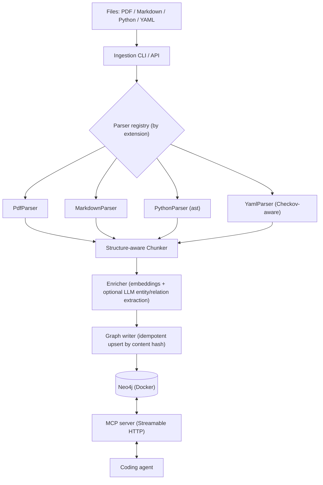

# graph-rag

**A local-first Graph RAG knowledge base for coding agents, served over MCP.**

[](https://github.com/tmustafiz/graph-rag/actions/workflows/ci.yml)
[](LICENSE)
[](pyproject.toml)
[](https://modelcontextprotocol.io)

graph-rag ingests the heterogeneous stuff a coding agent needs to reason about —
service docs (PDF), internal Markdown, your Python source, and YAML policy files
(Checkov) — into a single **Neo4j knowledge graph**, and exposes it to the agent
over an **MCP server**: hybrid (vector + full-text) search, table-of-contents
navigation, exact policy lookup, code-centrality ranking, graph traversal, and
the agent's own **persistent working memory**.

It runs entirely on your machine. The default embedding model is local, so
ingestion needs no API key and works offline.

## Why

Plain vector RAG loses structure: it can't tell you *which section* a chunk came
from, *what calls* a function, or *which policy applies to* `aws_db_instance`.
graph-rag keeps those relationships as graph edges, so an agent can both search
semantically **and** traverse — "find the retry section, then show me its parent
chapter", "rank this codebase's most-depended-upon functions", "give me the
Checkov rules for this resource type". It also gives the agent a place to
`remember` decisions and `recall` them in a later session.

## Demo

<!-- TODO: add an asciinema / GIF of an agent calling search_code + recall -->

## Quickstart

Requires [`uv`](https://docs.astral.sh/uv/) and Docker.

```bash
cp .env.example .env        # adjust NEO4J_PASSWORD if you like
make install                # uv sync --all-extras
make fetch-model            # download the local embedding model (~87 MB)
make up                     # start Neo4j (Docker)
make apply-schema           # constraints + full-text + vector indexes
make ingest INGEST_PATH=examples/checkov-policies   # or point at your own docs
make mcp-serve              # MCP server on http://127.0.0.1:8765/mcp
```

graph-rag ships **no document corpus** — you bring the files to ingest.
`examples/` holds a few small samples to try the tooling against; everything
else is yours.

Neo4j Browser: <http://localhost:7474> (`neo4j` / your `NEO4J_PASSWORD`).

Or run everything (Neo4j + MCP server) with Compose:

```bash
docker compose up -d
```

Other targets: `make down`, `make lint`, `make format`, `make test`, `make eval`.

## Connect an agent

The MCP server speaks Streamable HTTP at `http://127.0.0.1:8765/mcp`.
`.mcp.json` at the repo root already registers it for this project.

**Claude Code**

```bash
claude mcp add graph-rag --transport http http://127.0.0.1:8765/mcp
```

**Claude Desktop / Cursor / Windsurf / VS Code** — add to the MCP config:

```json
{
  "mcpServers": {
    "graph-rag": { "type": "http", "url": "http://127.0.0.1:8765/mcp" }
  }
}
```

Set `MCP_AUTH_TOKEN` in `.env` to require a bearer token (defense in depth; the
server is bound to `127.0.0.1` regardless — see [SECURITY.md](SECURITY.md)).

### stdio transport

For clients that launch the server as a subprocess instead of connecting over
HTTP, run `graph-rag serve-mcp --stdio` — no port, no auth token, no
`POST /ingest`. Point the client's command at it:

```json
{
  "mcpServers": {
    "graph-rag": { "command": "graph-rag", "args": ["serve-mcp", "--stdio"] }
  }
}
```

Use `uv run graph-rag …` (or an absolute path to the entry point) as the
`command` if `graph-rag` isn't on the client's `PATH`. Neo4j still has to be
reachable at `NEO4J_URI`.

## MCP tools

| Tool | What it does |
| --- | --- |
| `search` | Hybrid (vector + full-text) search over ingested prose / Markdown / generic-YAML chunks. Does **not** cover Python code or Checkov policy text. |
| `search_code` | Same hybrid search, over ingested Python functions / classes / modules. |
| `search_policies` | Hybrid search over Checkov policy content — the fuzzy complement to `find_policies_for`. |
| `find_policies_for` | **Exact-match** traversal: policies whose `APPLIES_TO` edge names a Terraform resource type precisely (e.g. `aws_db_instance`). No fuzzy fallback. |
| `get_section` / `get_outline` | Full section text (paginated via `max_chars`) or a source's table-of-contents tree. |
| `list_sources` | Everything currently ingested (also the `graph-rag://sources` MCP **resource**). |
| `get_neighbors` | Walk the graph from any node — Source path, Section/Chunk/PolicyRule/AgentMemory id, CodeEntity qualified name, or Concept name — optionally filtered by relationship type. |
| `get_central_code_entities` | Most-depended-upon code by PageRank over the `CALLS`/`IMPORTS` graph. Empty until `graph-rag compute-centrality` has run. |
| `cite` | Human-readable citation string for a chunk. |
| `ingest_path` | (Re-)ingest a file or directory from within a session. |
| `remember` / `recall` / `forget` | The agent's own working memory, with recency + frequency decay pruning. |

## Ingesting your own content

`graph-rag ingest <path>` takes a file or a directory (recursed), parses
whichever of PDF / Markdown / Python / YAML it finds, and upserts into the
graph. Re-running is cheap: a file whose content hash is unchanged since the
last ingest is skipped entirely, and re-ingesting a changed file removes any
Section / Chunk / CodeEntity / PolicyRule it no longer produces.

```bash
uv run graph-rag ingest src/graph_rag           # this repo's own source
uv run graph-rag ingest path/to/docs            # a whole directory
uv run graph-rag ingest some/file.py --dry-run  # preview, no writes
uv run graph-rag ingest src/graph_rag --watch   # re-ingest on every change
```

A file that fails to parse/embed/write is reported and skipped rather than
aborting the batch — see
[docs/operations.md](docs/operations.md#ingestion-errors-and-logging).

Ingestion is also reachable over plain HTTP while `serve-mcp` / `docker compose
up` is running, for triggering from CI or a pre-commit hook without an MCP
client:

```bash
curl -X POST http://127.0.0.1:8765/ingest \
  -H "Content-Type: application/json" \
  -d '{"path": "src/graph_rag", "dry_run": false}'
```

## Code centrality (PageRank)

`graph-rag compute-centrality` runs GDS PageRank over the `CodeEntity`
`CALLS`/`IMPORTS` graph, writing each entity's score to `CodeEntity.pagerank`
— a heavily called/imported entity ranks higher, surfacing what's most central
(and riskiest to change) in an ingested codebase. Exposed via
`get_central_code_entities`. Needs Python source already ingested and the
`graph-data-science` Neo4j plugin (enabled in `docker-compose.yml`):

```bash
uv run graph-rag ingest src/graph_rag
uv run graph-rag compute-centrality   # re-run after ingesting code changes
```

## Offline embedding model

The MCP server and ingestion embed with `sentence-transformers/all-MiniLM-L6-v2`
(Apache-2.0). `make fetch-model` downloads just the PyTorch + tokenizer files
(~87 MB) into `models/all-MiniLM-L6-v2/` — see
[scripts/fetch_model.py](scripts/fetch_model.py). `SentenceTransformerEmbedder`
loads from that folder when present and otherwise pulls the model from the Hub
at first use, so a checkout without the folder still works as long as it can
reach `huggingface.co`.

## Architecture



Design and component breakdown: [docs/ARCHITECTURE.md](docs/ARCHITECTURE.md).
Roadmap and planning: [docs/ROADMAP.md](docs/ROADMAP.md).
Backup/restore and day-2 ops: [docs/operations.md](docs/operations.md).

## Contributing

Issues and PRs welcome — see [CONTRIBUTING.md](CONTRIBUTING.md). The repo follows
a strict one-class-per-file layout; the conventions are spelled out there. By
contributing you agree your work is licensed under Apache-2.0.

## License

[Apache License 2.0](LICENSE). See [NOTICE](NOTICE) for third-party components.
