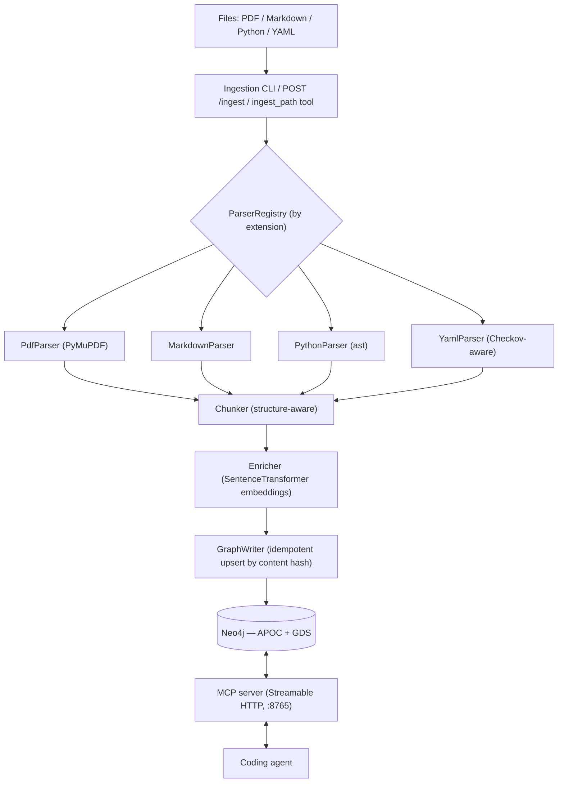

# Architecture

graph-rag ingests heterogeneous sources (PDF, Markdown, Python, YAML/Checkov)
into a single **Neo4j** knowledge graph and serves retrieval — plus the agent's
own working memory — to coding agents over an **MCP** server. Adding a new file
type is a self-contained parser plugin; nothing downstream of it changes.

Planning and roadmap live in [GitHub Issues, Milestones, and the project
board](ROADMAP.md), not in this repo.

## Overview

## Components

| Package | Responsibility |
| --- | --- |
| `graph_rag.ingest.parsers` | One `Parser` per file type. `parse(path) -> ParsedDocument` (Sections/Chunks/CodeEntities/PolicyRules). |
| `graph_rag.ingest.parser_registry` | Maps file extension → parser. New type = new module + one registration line. |
| `graph_rag.ingest.chunker` | Splits section body text into token-bounded, overlapping chunks that never cross a heading; keeps code/table blocks intact. |
| `graph_rag.ingest.embedders` | `Embedder` interface; `SentenceTransformerEmbedder` (local `all-MiniLM-L6-v2`, 384-dim) is the default — no API key, works offline. `build_embedder()` reads `GRAG_EMBEDDING_PROVIDER` and can instead return a hosted `RestEmbedder` (OpenAI / Ollama / Voyage / Cohere / Gemini — plain `httpx`, no SDKs), probing vector width against `EMBEDDING_DIMENSIONS` at startup. |
| `graph_rag.ingest.enricher` | Attaches embeddings to chunks / code entities / policy rules. |
| `graph_rag.ingestion_pipeline` | Orchestrates parse → hash-check → enrich → write. Skips unchanged files; deletes stale children of changed files. |
| `graph_rag.graph.schema` | Constraint + index DDL (`apply-schema`). Idempotent. |
| `graph_rag.graph.graph_writer` | Cypher `MERGE` upserts for every node/edge type. |
| `graph_rag.graph.centrality_analyzer` | GDS PageRank over the `CodeEntity` `CALLS`/`IMPORTS` graph → `CodeEntity.pagerank`. |
| `graph_rag.mcp_server.retriever` | Hybrid vector + full-text retrieval and graph traversal behind the MCP tools. |
| `graph_rag.mcp_server.knowledge_server` / `.memory_server` | Tool + resource definitions, one module per role; `server.py` combines both onto one server for `--role all`. |
| `graph_rag.memory` | `AgentMemory` write / recall / decay-pruning. |
| `graph_rag.cli` | `typer` CLI: `status`, `apply-schema`, `ingest`, `serve-mcp`, `compute-centrality`, `prune-memory`, `eval-retrieval`. |
| `graph_rag.http_app` | FastAPI app mounted alongside the MCP server; exposes `POST /ingest`. |

## Graph data model

**Nodes**

| Node | Key | Notable properties |
| --- | --- | --- |
| `Source` | `path` | `source_type`, `content_hash`, `ingested_at` |
| `Section` | `id` | `title`, `level`, `breadcrumb`, `order`, page range |
| `Chunk` | `id` | `text`, `token_count`, `embedding` (384-d), page/line range |
| `CodeEntity` | `qualified_name` | `name`, `signature`, `docstring`, `path`, line range, `embedding`, `pagerank` |
| `PolicyRule` | `id` | `name`, `category`, `severity`, `guideline`, `embedding` |
| `Concept` | `name` | e.g. a Terraform `resource_type` |
| `AgentMemory` | `id` | `content`, `embedding`, `last_accessed_at`, access count, soft-delete flag |

**Relationships**

- `(Source)-[:HAS_SECTION]->(Section)`, `(Section)-[:PARENT_OF]->(Section)`
- `(Section)-[:HAS_CHUNK]->(Chunk)`, `(Chunk)-[:NEXT]->(Chunk)` (reading order)
- `(Source)-[:DEFINES]->(CodeEntity)`, `(CodeEntity)-[:CONTAINS]->(CodeEntity)` (class → method)
- `(CodeEntity)-[:CALLS]->(CodeEntity)`, `(CodeEntity)-[:IMPORTS]->(CodeEntity)`
- `(Source)-[:DEFINES]->(PolicyRule)`, `(PolicyRule)-[:APPLIES_TO]->(Concept)`

**Indexes** (`grag-mcp apply-schema`)

- Uniqueness constraints on every node key above.
- Vector indexes (cosine, 384-d) on `Chunk`, `CodeEntity`, `PolicyRule`, `AgentMemory` `.embedding`.
- Full-text indexes on `Chunk.text`, `Section.title`, `CodeEntity` (name/qualified_name/docstring), `PolicyRule` (id/name/category/guideline), `AgentMemory.content`.
- Range indexes on `AgentMemory.last_accessed_at` and `CodeEntity.pagerank`.

## Ingestion

`grag-mcp ingest <path>` (file or directory, recursive) → `ParserRegistry`
picks a parser by extension → `Chunker` → `Enricher` (embeddings) →
`GraphWriter` upserts.

Idempotency is content-hash driven: a `Source` whose file hash is unchanged
since the last run is skipped entirely (no re-parse, no re-embed). Re-ingesting
a changed file removes any `Section` / `Chunk` / `CodeEntity` / `PolicyRule` it
no longer produces. A file that fails to parse/embed/write is recorded and
skipped without aborting the batch.

The same operation is reachable three ways: the CLI, the `ingest_path` MCP tool,
and `POST /ingest` (for CI / pre-commit hooks with no MCP client).

## Retrieval

`search` / `search_code` / `search_policies` run **hybrid retrieval**: a vector
similarity query fetches the candidate set (`top_k * multiplier`), and a
full-text query over the same corpus contributes a boost, score-fused as
`0.7 * vector + 0.3 * full-text` after min-max normalization (see
`retriever.combine_scores`), then truncated to `top_k`.

The vector query defines the candidate set: full-text only re-weights ids the
vector search already surfaced. A hit that full-text alone would find but the
bi-encoder ranks outside `top_k * multiplier` is not recovered — and, since the
reranker also sees only that shortlist, not recovered by reranking either.

Setting `GRAG_RERANK=1` inserts a cross-encoder pass between fusion and
truncation: `CrossEncoderReranker` re-scores the fused shortlist by reading the
query and each candidate together (`retriever._maybe_rerank`) and reorders by
that score, with the fused score breaking ties. Each hit then carries both
`score` (the fused value, unchanged) and `rerank_score` (the raw logit). Off by
default; the model must resolve to a local copy (`GRAG_RERANK_MODEL` env →
mounted image dir → `models/` in a checkout) or construction fails at startup —
it is not baked into the image and there is no implicit Hub download. See the
README "Reranking" section for the before/after eval numbers.

Setting `GRAG_QUERY_REWRITE=1` adds a stage on the other side of retrieval —
*before* the candidate set is formed. A `QueryRewriter` turns the query into up
to `GRAG_QUERY_REWRITE_MAX_QUERIES` variants (`HeuristicQueryRewriter`, an
offline acronym/split expander, by default; `LlmQueryRewriter` against an
OpenAI-compatible endpoint when `GRAG_QUERY_REWRITE_MODEL` is set), each search
method runs the full vector+full-text pass per variant, and
`retriever._merge_keeping_max` folds the per-variant fused scores into one
best-score-per-id map that then feeds the reranker/truncation stage unchanged.
A rewriter never raises: any backend failure degrades to the single original
query. Off by default; wired only for the `knowledge`/`all` roles.

Graph-native tools sit alongside search: `get_section` / `get_outline`
(hierarchy walk), `get_neighbors` (traverse from any node), `find_policies_for`
(exact `APPLIES_TO` traversal), `get_central_code_entities` (PageRank order),
`cite` (citation string), `list_sources`.

## MCP server

`grag-mcp serve-mcp` runs over **Streamable HTTP** by default — a long-lived
process (its own compose service) so the embedding model and the Neo4j driver
pool stay warm across agent sessions. `--stdio` switches to the stdio transport
for clients that spawn the server per session; it shares the same tool wiring
but skips the HTTP app, the `POST /ingest` route, and the auth-token gate.

`--role knowledge|memory|all` (default `all`) selects which tools that wiring
exposes: `all` is `build_server` in `mcp_server/server.py`, one server with
every tool, unchanged from before `--role` existed. `knowledge` and `memory`
are `build_knowledge_server`/`build_memory_server` — each a standalone server
with only its half of the tools, meant to run as an independent process
against its own Neo4j. `POST /ingest` (a knowledge concern) is only mounted
when an `IngestionPipeline` exists, i.e. for `knowledge`/`all`. All three
roles share the same tool implementations (`register_knowledge_tools`/
`register_memory_tools`), so there is exactly one copy of each tool's body
regardless of which server(s) it ends up registered on.

Security posture of the HTTP transport (see [SECURITY.md](../SECURITY.md)):

- Binds `127.0.0.1` by default; `docker-compose.yml` publishes on loopback only.
- Origin / DNS-rebinding protection is always on (`TransportSecuritySettings` in
  `cli.py`), even when `MCP_HOST=0.0.0.0` inside a container.
- Optional `MCP_AUTH_TOKEN` bearer check as defense in depth.

stdio has no network surface — the client owns the process's stdin/stdout — so
those controls don't apply.

## Agent memory

`remember` / `recall` / `forget` store `AgentMemory` nodes (embedded, so
`recall` is semantic; ranked by relevance plus an `importance` and a
recency/frequency boost). `grag-mcp prune-memory` (no args needed) soft-deletes
memories whose decay score `(1 + access_count) * exp(-days_since_last_recall/30)`
falls below a threshold and hard-deletes ones past a grace window; schedule it
per `docs/operations.md`.

`remember(about_qualified_name=...)` links a memory to a `CodeEntity` two
ways: `about_qualified_name` is always stored as a plain property on
`AgentMemory` — the source of truth `recall`'s `about_qualified_name` filter
matches against — and, best-effort, an `(:AgentMemory)-[:ABOUT]->(:CodeEntity)`
edge is also merged when a `CodeEntity` with that `qualified_name` exists in
this database. The edge is what `get_neighbors` walks to answer "what's been
remembered about this function" from the code side; it only forms when
agent memory and the knowledge base share one database. The property is what
makes `recall(about_qualified_name=...)` correct either way, including a
memory-only deployment with no `CodeEntity` nodes at all.

## Deployment

- **Local:** `make up` (Neo4j) + `make mcp-serve`, or `docker compose up -d` for
  both.
- **Image:** multi-stage `Dockerfile` — the app venv is built against a
  standalone CPython and copied into `gcr.io/distroless/cc-debian13:nonroot`
  (no shell, no package manager, non-root). Every base image (`BUILDER_IMAGE`,
  `RUNTIME_IMAGE`, `UV_IMAGE`, `NEO4J_IMAGE`) is overridable for environments
  restricted to an approved hardened registry — see
  [operations.md](operations.md#restricted--hardened-registry-environments).
  Three build targets share one `builder-base`/lockfile: the untargeted
  default (`serve-mcp`, no `--role` — what `docker-compose.yml` builds) and
  `knowledge` both install `[pdf]` and are content-identical, differing only
  in `CMD`; `memory` installs the bare package (no parser stack, no
  `pymupdf`) and pins `--role memory`.
- **Neo4j:** Community edition with the APOC and Graph Data Science plugins
  (GDS is only needed for `compute-centrality`).
- **Split deployment (optional):** `docker-compose.knowledge.yml` /
  `docker-compose.memory.yml` run the `knowledge`/`memory` images against
  their own Neo4j each, instead of the combined `docker-compose.yml` stack —
  see [operations.md](operations.md#split-deployment-optional).

Backup/restore and day-2 operations: [operations.md](operations.md).
