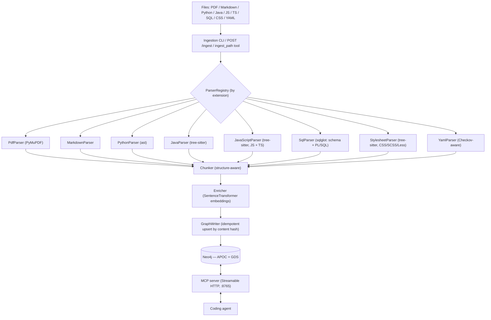

# Architecture

graph-rag ingests heterogeneous sources (PDF, Markdown, source code,
YAML/Checkov) into a single **Neo4j** knowledge graph and serves retrieval —
plus the agent's own working memory — to coding agents over an **MCP** server.
Adding a new file type — or a new source language — is a self-contained parser
plugin; nothing downstream of it changes.

Planning and roadmap live in [GitHub Issues, Milestones, and the project
board](ROADMAP.md), not in this repo.

## Overview

## Components

| Package | Responsibility |
| --- | --- |
| `graph_rag.ingest.parsers` | One `Parser` per file type. `parse(path) -> ParsedDocument` (Sections/Chunks/CodeEntities/PolicyRules). |
| `graph_rag.ingest.parser_registry` | Maps file extension → parser. New type = new module + one registration line. |
| `graph_rag.ingest.chunker` | Splits section body text into token-bounded, overlapping chunks that never cross a heading; keeps code/table blocks intact. |
| `graph_rag.ingest.embedders` | `Embedder` interface; `SentenceTransformerEmbedder` (local `all-MiniLM-L6-v2`, 384-dim) is the default — no API key, works offline. `build_embedder()` reads `GRAG_EMBEDDING_PROVIDER` and can instead return a hosted `RestEmbedder` (OpenAI / Ollama / Voyage / Cohere / Gemini — plain `httpx`, no SDKs), probing vector width against `EMBEDDING_DIMENSIONS` at startup. |
| `graph_rag.ingest.enricher` | Attaches embeddings to chunks / code entities / policy rules / DB tables / DB views / HTTP endpoints. |
| `graph_rag.ingestion_pipeline` | Orchestrates parse → hash-check → enrich → write. Skips unchanged files; deletes stale children of changed files. |
| `graph_rag.graph.schema` | Constraint + index DDL (`apply-schema`). Idempotent. |
| `graph_rag.graph.graph_writer` | Cypher `MERGE` upserts for every node/edge type. |
| `graph_rag.graph.project_model_resolver` | Post-ingest pass: `(Source)-[:IN_MODULE]->(Module)` (nearest containing module, compared over `os.path.abspath` so a relative ingest still links), sibling-dependency promotion, and `IMPORTS.external` classification. |
| `graph_rag.graph.spring_bean_resolver` | Post-directory-ingest pass: `Bean` nodes + `IS_BEAN` / `INJECTS` / `PRODUCES` / `BINDS` from the annotation + type-hierarchy + config layers. |
| `graph_rag.graph.spring_xml_resolver` | Post-directory-ingest pass (after `spring_bean_resolver`): projects `SpringXmlBean` defs into the same `Bean` graph (`defined_in:'xml'`), resolves `<ref>` wiring across XML + annotation beans, and `IMPORTS_CONTEXT` for `<import resource>` / `<context:property-placeholder>`. |
| `graph_rag.graph.spring_data_resolver` | Post-ingest pass (after `spring_xml_resolver`): tags repository / entity `CodeEntity`s `:Repository` / `:JpaEntity`, tags repo methods with `query_kind` / `query_text`, and wires `MANAGES` / `PERSISTS_AS` / `RELATES_TO` from the `SpringDataRepoDef` / `JpaEntityDef` defs. |
| `graph_rag.graph.spring_injection_resolver` | Final Spring post-ingest pass: MERGEs a `:Bean` + `IS_BEAN` for every Spring Data repository interface (`bean_type` = interface FQN), then re-resolves any bean's `unresolved_injections` against the complete (annotation + XML + repository) bean set, promoting a now-unique match to an `INJECTS` edge. |
| `graph_rag.graph.aop_resolver` | Post-ingest pass (after the Spring passes): best-effort AspectJ pointcut matching — resolves each `@Aspect` advice's `execution(…)` / `within(…)` / `@annotation(…)` pointcut (with `&&` / `\|\|` and one level of named-`@Pointcut` substitution) to the `CodeEntity`s it advises, rebuilding `(:Advice)-[:ADVISES]->(:CodeEntity)` and recording `Advice.unresolved_reason` for what it can't match. |
| `graph_rag.graph.service_call_resolver` | Post-ingest pass (last): links each outbound `HttpEndpoint` (`@FeignClient` / `@HttpExchange` client method) to the ingested `@RestController` route it calls — `(:HttpEndpoint {outbound:true})-[:RESOLVES_TO]->(:HttpEndpoint inbound)` — matched on `(http_method, path)` with path variables normalized. |
| `graph_rag.graph.centrality_analyzer` | GDS PageRank over the `CodeEntity` `CALLS`/`IMPORTS` graph → `CodeEntity.pagerank`. |
| `graph_rag.mcp_server.retriever` | Hybrid vector + full-text retrieval and graph traversal behind the MCP tools. |
| `graph_rag.mcp_server.knowledge_server` / `.memory_server` | Tool + resource definitions, one module per role; `server.py` combines both onto one server for `--role all`. |
| `graph_rag.memory` | `AgentMemory` write / recall / decay-pruning. |
| `graph_rag.cli` | `typer` CLI: `status`, `apply-schema`, `ingest`, `serve-mcp`, `compute-centrality`, `prune-memory`, `eval-retrieval`. |
| `graph_rag.http_app` | FastAPI app mounted alongside the MCP server; exposes `POST /ingest`. |

## Graph data model

**Nodes**

| Node | Key | Notable properties |
| --- | --- | --- |
| `Source` | `path` | `source_type`, `content_hash`, `ingested_at` |
| `Section` | `id` | `title`, `level`, `breadcrumb`, `order`, page range |
| `Chunk` | `id` | `text`, `token_count`, `embedding` (384-d), page/line range |
| `CodeEntity` | `qualified_name` (globally unique across every language) | `name`, `kind` (per-language vocabulary), `language`, `signature`, `docstring`, `path`, line range, `embedding`, `pagerank`, `synthetic` / `origin` (compile-time-synthesized members, e.g. Lombok) |
| `PolicyRule` | `id` | `name`, `category`, `severity`, `guideline`, `embedding` |
| `Concept` | `name` | e.g. a Terraform `resource_type` |
| `AgentMemory` | `id` | `content`, `embedding`, `last_accessed_at`, access count, soft-delete flag |
| `DbTable` | `qualified_name` (`schema.table`, dialect-qualified) | `name`, `schema_name`, `embed_text`, `embedding` |
| `DbColumn` | `qualified_name` (`schema.table.column`) | `name`, `data_type`, `nullable`, `default`, `primary_key` |
| `DbView` | `qualified_name` (`schema.view`) | `name`, `schema_name`, `materialized`, `embed_text`, `embedding` |
| `DbIndex` | `qualified_name` (`schema.table.index`) | `name`, `columns`, `unique` |
| `Annotation` | `id` (hash of owner + target + fqn + line) | `name`, `fqn` (import-resolved), `target` (`type`/`method`/`constructor`/`field`/`param:<name>`), `attributes` (JSON string), `line` |
| `BehaviorMarker` | `id` (hash of owner + target + marker + line) | `marker` (`transactional` / `async` / `scheduled` / `retryable` / `cacheable` / `cache_put` / `cache_evict` / `pre_authorize` / `post_authorize` / `secured` / `roles_allowed`), `target` (`type`/`method`), `attributes` (JSON string), `line` |
| `Advice` | `id` (hash of advice method qn + kind) | `kind` (`before`/`after`/`after_returning`/`after_throwing`/`around`/`pointcut`), `pointcut_expr`, `pointcut_ref`, `aspect`, `unresolved_reason` (set by `AopResolver` when a pointcut matched nothing / is unsupported) |
| `EventType` | `fqn` (import-resolved where possible, else simple name — one canonical node per simple name) | `simple_name` — an in-process application event, bridging publisher and `@EventListener` |
| `Destination` | `id` (`<broker>:<name>`) | `name` (literal topic/queue/exchange), `broker` (`kafka`/`rabbit`/`jms`/`sqs`/`stream`/`unknown`) |
| `ConfigFile` | `path` (= owning `Source.path`) | `format` (`properties` / `yaml` / `spring-xml`); for `spring-xml` also `scan_packages`, `placeholder_locations`, `import_resources`, `namespace_elements` |
| `ConfigProperty` | `id` (hash of file + profile + key + line) | `key` (dotted, list items `[i]`), `value` (string), `profile` (`None` = default), `origin_line` |
| `SpringXmlBean` | `id` (hash of `source_path` + `bean_id`) | `bean_id` / `bean_name`, `class_name`, `scope`, `parent`, `factory_bean` / `factory_method`, `primary`, `abstract`, `aliases`, `constructor_arg_refs`, `property_names` / `property_refs`, `value_placeholder_keys` — raw `<bean>` def, projected into `Bean` by the XML resolver |
| `Module` | `path` (module directory, absolute) | `artifact`, `group`, `version`, `build_tool` (`maven` / `gradle`), `packages` (owned package prefixes), `source_roots` |
| `ExternalArtifact` | `gav` (`group:artifact`) | `group`, `artifact`, `version` |
| `Bean` | `id` (owning `CodeEntity.qualified_name`; XML beans use a `source_path`+`bean_id` hash, stubs `xml-stub::<ref>`) | `name` (Spring bean name), `stereotype` (`XmlBean` / `XmlBeanStub` for XML-wired), `scope`, `primary`, `bean_type`, `defined_in` (`xml` when from a `<beans>` context), `unresolved_injections` (JSON) |
| `HttpEndpoint` | `id` (hash of handler + method + path) | `http_method`, `path` (class + method composed), `framework` (`spring-mvc` / `jax-rs` / `feign` / `spring-http-interface`), `produces`, `consumes`, `params`, `bindings` (JSON), `outbound` (true for a `@FeignClient` / `@HttpExchange` client call), `target_service` (Feign `name` / `url`), `embed_text`, `embedding` (384-d) |
| `SpringDataRepoDef` / `JpaEntityDef` | `qualified_name` | Per-`.java` raw extract of a Spring Data repository (`base`, `entity_type`, `id_type`, `reactive`, parallel `method_*` arrays) / JPA type (`kind`, `table`, `id_fields`, parallel `association_*` arrays); projected onto the `CodeEntity` by `SpringDataResolver` |

A `CodeEntity` may also carry a **`:Repository`** label (`repository_base` / `repository_entity_type` / `repository_id_type` / `repository_reactive`), a **`:JpaEntity`** label (`jpa_kind` / `jpa_table`), or, on a repository method, `query_kind` (`derived` / `jpql` / `native` / `modifying` / `procedure` / `inherited`) + `query_text` + `query_properties` — all set by `SpringDataResolver`.

**Relationships**

- `(Source)-[:HAS_SECTION]->(Section)`, `(Section)-[:PARENT_OF]->(Section)`
- `(Section)-[:HAS_CHUNK]->(Chunk)`, `(Chunk)-[:NEXT]->(Chunk)` (reading order)
- `(Source)-[:DEFINES]->(CodeEntity)`, `(CodeEntity)-[:CONTAINS]->(CodeEntity)` (class → method)
- `(CodeEntity)-[:CALLS]->(CodeEntity)`, `(CodeEntity)-[:IMPORTS]->(CodeEntity)` (`IMPORTS.external` — set by the project-model resolver: `false` for first-party / in-project targets, `true` for third-party)
- `(CodeEntity)-[:RENDERS]->(CodeEntity)` (React `component` → child component, from the JSX it mounts)
- `(CodeEntity)-[:EXTENDS]->(CodeEntity)` (superclass, or an interface's super-interface), `(CodeEntity)-[:IMPLEMENTS]->(CodeEntity)` (Java, best-effort import-resolved)
- `(CodeEntity)-[:ANNOTATED_WITH]->(Annotation)` (Java annotations on a type / method / constructor / annotated field / parameter)
- `(CodeEntity)-[:HAS_BEHAVIOR {marker}]->(BehaviorMarker)` (`@Transactional` / `@Scheduled` / `@Async` / `@Cacheable` / `@PreAuthorize` / … — the marker slug is also mirrored onto `CodeEntity.behaviors` for cheap scans)
- `(CodeEntity)-[:ADVICE_OF]->(Advice)` (an `@Aspect` advice / `@Pointcut` method → its `Advice` node), `(Advice)-[:ADVISES]->(CodeEntity)` (best-effort pointcut match, wired by `AopResolver`)
- `(CodeEntity)-[:PUBLISHES]->(EventType)-[:CONSUMED_BY]->(CodeEntity)` (`publishEvent(...)` call site → event class → `@EventListener` method — links across files via the MERGE-shared `EventType`)
- `(CodeEntity)-[:PRODUCES_TO]->(Destination)-[:CONSUMED_BY]->(CodeEntity)` (`KafkaTemplate`/`RabbitTemplate`/`JmsTemplate` `.send(...)` → literal topic/queue → `@KafkaListener` / `@RabbitListener` / `@JmsListener` / `@SqsListener` method)
- `(Source)-[:DEFINES]->(ConfigFile)`, `(ConfigFile)-[:HAS_PROPERTY]->(ConfigProperty)`
- `(ConfigProperty)-[:REFERENCES]->(ConfigProperty)` (`${a.b}` placeholder, resolved within the file)
- `(ConfigFile)-[:DECLARES_BEAN]->(SpringXmlBean)` (one per `<bean>` in a Spring XML context)
- `(ConfigFile)-[:IMPORTS_CONTEXT {kind}]->(ConfigFile)` (`kind` = `import` for `<import resource>`, `property-placeholder` for `<context:property-placeholder location>`; only when the target file was ingested)
- `(Source)-[:DEFINES]->(PolicyRule)`, `(PolicyRule)-[:APPLIES_TO]->(Concept)`
- `(Source)-[:DEFINES]->(DbTable|DbColumn|DbView|DbIndex)`
- `(DbTable)-[:HAS_COLUMN]->(DbColumn)`, `(DbTable)-[:HAS_INDEX]->(DbIndex)`
- `(DbColumn)-[:REFERENCES]->(DbColumn)`, `(DbTable)-[:REFERENCES]->(DbTable)` (foreign keys)
- `(DbView)-[:DEPENDS_ON]->(DbTable|DbView)` (tables/views in the view's `SELECT`)
- `(CodeEntity)-[:READS]->(DbTable)`, `(CodeEntity)-[:WRITES]->(DbTable)` (a SQL routine's `SELECT` vs `INSERT`/`UPDATE`/`DELETE`/`MERGE`)
- `(CodeEntity)-[:ON]->(DbTable)` (the table a `trigger` fires on)
- `(Source)-[:IMPORTS]->(Source)` (stylesheet `@import` / `@use` / `@forward`)
- `(Source)-[:DEFINES]->(Module)`, `(Source)-[:IN_MODULE]->(Module)` (every file → its nearest module directory)
- `(Module)-[:DEPENDS_ON {scope}]->(Module)` (Maven reactor / sibling GAV / Gradle `project(':x')`), `(Module)-[:DEPENDS_ON_EXTERNAL {gav, scope}]->(ExternalArtifact)`
- `(CodeEntity)-[:IS_BEAN]->(Bean)`, `(Bean)-[:INJECTS {via, qualifier, multiplicity, property}]->(Bean)` (`via` also `xml-constructor` / `xml-property` for XML-wired), `(Bean)-[:PRODUCES]->(Bean)` (`@Bean` method), `(Bean)-[:BINDS]->(ConfigProperty)` (`@Value` / `@ConfigurationProperties` / XML `<property value="${…}">`)
- `(HttpEndpoint)-[:HANDLED_BY]->(CodeEntity)` (the Spring MVC / JAX-RS handler method), `(HttpEndpoint)-[:IN_MODULE]->(Module)`
- `(CodeEntity)-[:CALLS_SERVICE]->(HttpEndpoint {outbound:true})` (a `@FeignClient` / `@HttpExchange` client method → the outbound call it declares), `(HttpEndpoint outbound)-[:RESOLVES_TO]->(HttpEndpoint inbound)` (wired by `ServiceCallResolver` when a matching controller route is ingested — a cross-service call graph)
- `(Source)-[:DEFINES]->(SpringDataRepoDef|JpaEntityDef)` (per-`.java` raw extract)
- `(CodeEntity:Repository)-[:MANAGES]->(CodeEntity:JpaEntity)` (repo's managed domain type), `(CodeEntity:JpaEntity)-[:PERSISTS_AS]->(DbTable)` (only when a `DbTable` with that name was ingested), `(CodeEntity:JpaEntity)-[:RELATES_TO {kind, mapped_by, field}]->(CodeEntity:JpaEntity)` (`@OneToMany` / `@ManyToOne` / `@ManyToMany` / `@OneToOne`)

**Indexes** (`grag-mcp apply-schema`)

- Uniqueness constraints on every node key above.
- Vector indexes (cosine, 384-d) on `Chunk`, `CodeEntity`, `PolicyRule`, `AgentMemory`, `DbTable`, `DbView`, `HttpEndpoint` `.embedding`.
- Full-text indexes on `Chunk.text`, `Section.title`, `CodeEntity` (name/qualified_name/docstring), `PolicyRule` (id/name/category/guideline), `AgentMemory.content`, `DbTable`/`DbView` (name/qualified_name/embed_text), `Annotation` (name/fqn), `ConfigProperty` (key/value), `Module` (artifact/group), `Bean` (name/stereotype/bean_type), `HttpEndpoint` (path/embed_text).
- Range indexes on `AgentMemory.last_accessed_at` and `CodeEntity.pagerank`.

## Ingestion

`grag-mcp ingest <path>` (file or directory, recursive) → `ParserRegistry`
picks a parser by extension → `Chunker` → `Enricher` (embeddings) →
`GraphWriter` upserts.

Idempotency is content-hash driven: a `Source` whose file hash is unchanged
since the last run is skipped entirely (no re-parse, no re-embed). Re-ingesting
a changed file removes any `Section` / `Chunk` / `CodeEntity` / `PolicyRule` it
no longer produces. A file that fails to parse/embed/write is recorded and
skipped without aborting the batch.

Build files (`pom.xml`, `*.gradle*`) parse first so the `Module` layer exists
before the `.java` files, and once the batch is done seven graph passes run in
order: `ProjectModelResolver` wires `IN_MODULE`, promotes sibling dependencies
and classifies `IMPORTS.external`; `SpringBeanResolver` derives the annotation
`Bean` layer; `SpringXmlResolver` folds the `SpringXmlBean` defs from any
`<beans>` contexts into that same `Bean` layer; `SpringDataResolver` tags the
repository / JPA-entity `CodeEntity`s and wires `MANAGES` / `PERSISTS_AS` /
`RELATES_TO`; finally `SpringInjectionResolver` makes every Spring Data
repository interface a `:Bean` and re-runs injection resolution over the now
complete bean set, so an annotation bean wiring an XML-only bean or a
repository (unresolvable when the first pass ran) gets its `INJECTS` edge;
`AopResolver` matches every `@Aspect` advice's pointcut to the
`CodeEntity`s it advises; finally `ServiceCallResolver` links each outbound
`@FeignClient` / `@HttpExchange` endpoint to the controller route it calls. The
same passes also run after a **single-file** ingest — each is a full-graph
rebuild — so `ingest_path` / `grag ingest <file>` / `--watch` keep the
projections in sync with an edit.

The same operation is reachable three ways: the CLI, the `ingest_path` MCP tool,
and `POST /ingest` (for CI / pre-commit hooks with no MCP client).

## Adding a language

A source-language parser is the same plugin shape as any other parser — a
class satisfying the `Parser` protocol (`can_handle(path) -> bool`,
`parse(path) -> ParsedDocument`), one module, one line in
`ParserRegistry._parsers`. What's language-specific:

- **Emit `CodeEntity`.** Set `language` on every entity. Pick a `kind`
  vocabulary that fits the language (`interface`, `enum`, `package`,
  `procedure`, …) — it's a free string, documented per parser, not an enum.
- **Namespace `qualified_name`.** It is the *single* unique key for
  `CodeEntity` across all languages, so two languages must never produce the
  same string. Python uses dotted module ancestry; a language with no global
  module namespace should prefix with its repo-relative path or a language
  tag.
- **`CALLS` / `IMPORTS` are best-effort static.** No type inference — resolve
  what's unambiguous (local definitions, explicit imports, `self`/`this`
  members) and skip the rest rather than guess, as `PythonParser` does.
- **Third-party parse backend → optional extra.** Unlike `PythonParser`
  (stdlib `ast`), other languages need a library (`tree-sitter` +
  `tree-sitter-language-pack` for Java / JS / TS / CSS; `sqlglot` for
  SQL / PL-SQL). Declare it as a `pyproject` extra (`grag-mcp[java]`, …) and
  guard the import inside `parse()` with a `RuntimeError` naming the extra,
  exactly like `PdfParser` does for `pymupdf`.

`search_code`, `get_neighbors`, and `compute-centrality` operate on
`CodeEntity` regardless of language, so a new parser needs no retrieval-side
change.

`JavaParser` (`grag-mcp[java]`, backed by `tree-sitter` +
`tree-sitter-language-pack`) is the first non-Python implementation and the
reference for the points above: `kind` is one of
`class` | `interface` | `enum` | `record` | `annotation` | `method` |
`constructor` | `field`; `qualified_name` is the package-prefixed, overload-safe
name (`com.acme.orders.OrderService.submit(Order,boolean)` — parameter types
taken verbatim from source, since there is no type resolution); plain fields are
folded into the owning type's `embed_text`, but an *annotated* field is emitted
as a `field` entity keyed `<type>#<field>` so framework wiring (`@Autowired`,
`@Value`, `@Column`) is visible; annotations on types, methods, constructors,
annotated fields, and parameters become `Annotation` nodes via
`ANNOTATED_WITH` (attribute values parsed to a JSON string; FQN resolved
against the file's imports, else the simple name); a type's direct supertypes
become `(CodeEntity)-[:EXTENDS]->` (superclass / an interface's
super-interface) and `-[:IMPLEMENTS]->` edges, names import-resolved the same
way; and there is no file-level `module` entity (Java has no unit below the
package), so a file's `imports` attach to its first top-level type.

`LombokSynthesizer` runs inside `JavaParser`: a type carrying `@Data` /
`@Getter` / `@Setter` / `@Value` / `@*ArgsConstructor` / `@Builder` /
`@Slf4j`(&friends) gets the members Lombok would generate at compile time
materialised as `CodeEntity`s — `getX()` / `isX()` / `setX()` per field, a
constructor with the right params (`@RequiredArgsConstructor` → the `final`,
un-initialised and `@NonNull` fields — this is what Spring injects through),
`builder()` + a `<Type>Builder` stub, and a `log` field. Each is flagged
`synthetic=true`, `origin="lombok"`, with `start_line`/`end_line` on the
annotated type; a field that already has an explicit accessor of the same name
is left alone. Separately, annotation-processor **output** under
`target/generated-sources` / `build/generated` is ingested as normal `.java` on
a directory run (run the build first); `GRAG_INGEST_GENERATED_SOURCES=false`
skips it.

`HttpEndpointExtractor` also runs inside `JavaParser` (single-file — a
controller and its handlers share a file). Spring MVC (`@RequestMapping` +
`@GetMapping` / `@PostMapping` / …, class + method path composition,
`produces` / `consumes` / `params` / `headers`) and JAX-RS (`@Path` + `@GET` /
`@POST` / …, `@Produces` / `@Consumes`) handler methods become
`HttpEndpoint`s — one per `(http_method, path)` pair. Parameter bindings
(`@PathVariable` / `@RequestParam` / `@RequestBody` / `@RequestHeader` /
`@ModelAttribute`, and `@PathParam` / `@QueryParam` / `@HeaderParam` /
`@FormParam`) are matched to the handler's parameters by name with their types
read from the method signature. `@ExceptionHandler` methods are recorded
best-effort with `http_method="EXCEPTION"`. `embed_text` reads
`"GET /orders/{id} -> OrderController.getOrder (returns Order) [spring-mvc]"`
so `search` / `search_code` surface routes from a natural-language query;
`(HttpEndpoint)-[:IN_MODULE]->(Module)` is wired by `ProjectModelResolver`.

`JavaScriptParser` (`grag-mcp[js]`, same backend) handles JavaScript,
TypeScript, and their JSX variants in one parser
(`.js` `.mjs` `.cjs` `.jsx` `.ts` `.tsx`) — TS and JSX are grammar variants of
the same parse, not separate parsers. Unlike Java it *does* emit a file-level
`module` entity (`qualified_name` is the project-relative path — nearest
`package.json` / `tsconfig.json` ancestor — dotted and extension-stripped, with
`index` collapsed to its directory), and the module carries the `imports`.
`kind` is `module` | `function` | `class` | `method` | `constructor` |
`interface` | `type` | `enum`; exported arrow/function `const`s become
`function` entities; TS `interface` / `type` / `enum` are signature-only (no
members-as-entities). Relative import specifiers (`./`, `../`) resolve against
the project tree to the same dotted form (named imports as `module.symbol`,
like Python's `from x import y`); bare specifiers (`react`, `lodash`) are kept
verbatim. `imports` covers ESM (`import`, `export … from`, `export *`, dynamic
`import()`) and CommonJS (`require`).

`ReactEnricher` is a second pass `JavaScriptParser` runs on `.jsx` / `.tsx`
files (and `.js` / `.ts` that import `react`): a `function` / `class` entity
that returns JSX or extends `React.Component` is retagged `kind="component"`,
each PascalCase JSX element it mounts that resolves (local def or import)
becomes a `(component)-[:RENDERS]->(component)` edge, and the hook calls
(`useX`) and prop names (first-arg destructuring or `props.` accesses) it uses
are folded into `embed_text` / `signature` so `search_code` can match them.
Unresolved and lowercase (`div`) tags are skipped, like `calls`. Prop *types*
and lifecycle call graphs are out of scope.

`SqlParser` (`grag-mcp[sql]`, backed by `sqlglot`) covers both **schema** and
**procedural** SQL from one file. `CREATE TABLE` / column /
`CREATE VIEW` (incl. materialized) / `CREATE INDEX` become `:DbTable` /
`:DbColumn` / `:DbView` / `:DbIndex` nodes keyed by dialect-qualified
`qualified_name` (`schema.table`, `schema.table.column`,
`schema.table.index`). Foreign keys (inline, table-level, and `ALTER TABLE …
ADD CONSTRAINT`) become `REFERENCES` edges at both column and table level; a
view's `SELECT` yields `DEPENDS_ON` edges to the tables/views it reads (CTE
names excluded); each table owns its columns via `HAS_COLUMN` and its indexes
via `HAS_INDEX`. An `ALTER` whose target table lives in another migration file
is carried as a standalone reference so the edge still lands once that table is
ingested. Dialect is `settings.sql_dialect` (env `GRAG_SQL_DIALECT`;
`postgres` / `mysql` / `tsql` / `oracle` / `snowflake` / `bigquery`, default
generic), overridable per file with a `-- grag:dialect=<name>` marker comment;
an unknown dialect or an unparseable file logs a warning and yields a `Source`
with no schema nodes. Tables and views are embedded (a rendered `CREATE TABLE
…` / view summary); wiring them into `search_code` (or a dedicated
`search_schema`) is a follow-up — the vector/full-text indexes are already
created.

`ProceduralSqlExtractor` (run by `SqlParser` on the same file, also for the
`.pks` / `.pkb` / `.prc` / `.fnc` / `.trg` / `.plsql` extensions) turns stored
procedures, functions, packages, and triggers into `CodeEntity` nodes —
`kind` ∈ `package` | `package_body` | `procedure` | `function` | `trigger`,
`qualified_name` = `schema.package.routine` (packaged, `parent_qualified_name`
= the package) or `schema.routine`. `sqlglot` handles T-SQL `CREATE PROCEDURE`
bodies as an AST; PL/pgSQL `$$…$$` bodies and all of Oracle PL/SQL
(packages, triggers, `RETURN` in a spec) are parsed by a delimiter-scoped
**regex sweep** — so the accuracy ceiling is dialect-dependent (see
`docs/operations.md`). A routine whose body can't be analyzed still yields its
header entity, with a logged warning. Best-effort `CALLS` links routines
(bare `proc(...)` resolved only when unambiguous, `pkg.proc(...)` when the
package is known); `READS` / `WRITES` link a routine to the `:DbTable`s its
body selects from / writes to, and `ON` links a `trigger` to its table.

`StylesheetParser` (`grag-mcp[css]`, tree-sitter `css` / `scss` / `less`
grammars — `.css` `.scss` `.sass` `.less`) is a **prose-shape** parser: no
`CodeEntity` (CSS has no call graph), just a `Section` per file (plus one per
top-level `@media` / `@supports`) and a `Chunk` per rule, so the plain
`search` tool covers stylesheet content. SCSS nesting is flattened into full
selector paths (`.card .title`, `.card:hover`); custom properties (`--x`),
`$variables`, and `@mixin`s each also get their own name-bearing chunk.
`@import` / `@use` / `@forward` resolve against the file tree to
`(Source)-[:IMPORTS]->(Source)` edges (Sass built-ins like `sass:math` and
remote URLs skipped). `.sass` indented syntax and constructs the grammar
version doesn't cover (`@extend`, some `@include` forms) degrade to a partial
result with a logged warning.

`ConfigFileParser` (stdlib + PyYAML, no extra) handles Spring / Java
application config — `application*` / `bootstrap*` (`.yml` / `.yaml` /
`.properties`) and any `*.properties` / `*.yml` under a `resources` directory.
It is registered **ahead of** `YamlParser`; a name-matched `.yml` that is
actually a Checkov custom policy (`metadata.id` + `definition`) is handed back
to `YamlParser`, and generic YAML elsewhere (k8s manifests, CI workflows) is
untouched. Each file becomes one `ConfigFile` plus a flattened `ConfigProperty`
list: YAML nesting → dotted keys (list items `[i]`), `.properties` read
line-wise (comment markers `#`/`!`, `\` line continuations, `#---`
multi-document separators). The active Spring profile comes from an
`application-<profile>` filename or a `spring.config.activate.on-profile` (or
legacy `spring.profiles`) key in the document; `${a.b:default}` placeholders
resolve, best-effort, to `(:ConfigProperty)-[:REFERENCES]->(:ConfigProperty)`
within the same file. Real line numbers survive (`yaml.compose_all`). A
`Section` + one `Chunk` per profile group make the content searchable via the
plain `search` tool; values under secret-looking keys (`password`, `secret`,
`token`, `credential`, a `key` segment) are redacted to `***` in that chunk
text only — the real value stays on the `ConfigProperty` node.

`MavenParser` (`pom.xml`, stdlib `xml.etree`) and `GradleParser`
(`build.gradle` / `build.gradle.kts` / `settings.gradle(.kts)`, tree-sitter
`groovy` / `kotlin`) build the **project model**. Each yields one `Module`
(`groupId` / `artifactId` / `version`, inherited from a Maven `<parent>` when
absent; Gradle `group` / `version` / `rootProject.name`), its declared
dependencies as `ExternalArtifact` + `ModuleDependency` (Maven `<scope>` /
Gradle configuration → the edge `scope`), reactor / `include` children as
`reactor` `ModuleDependency` edges, and discovered `source_roots`
(`src/main|test/java`, a `<sourceDirectory>` / `srcDirs` override, and
`target/generated-sources` / `build/generated` when they exist). Maven `${...}`
property interpolation is build-free and best-effort; Gradle extraction is
deliberately shallow (every call and `name = "value"` assignment, block
nesting ignored) and a grammar gap logs a warning and yields a partial
`Module`. Sibling resolution (`project(':x')` and matching GAVs →
`DEPENDS_ON`) and `IMPORTS.external` classification happen afterwards in
`ProjectModelResolver`, not in the parsers.

`SpringBeanResolver` is the second post-directory-ingest pass and reads only
from the graph. Type-level stereotype `Annotation`s (`@Component` / `@Service` /
`@Repository` / `@Controller` / `@RestController` / `@Configuration` /
`@SpringBootApplication` / `@ConfigurationProperties`, plus one level of custom
meta-annotated stereotype — an annotation type in-graph that is itself
stereotyped) and `@Bean` methods inside a bean class become
`(:Bean {name, stereotype, scope, primary, bean_type})` keyed by the owning
`CodeEntity.qualified_name`, linked `(:CodeEntity)-[:IS_BEAN]->(:Bean)`, and a
`@Configuration` bean `-[:PRODUCES]->` its `@Bean` methods. Injection points —
constructor parameters (the sole constructor, or the `@Autowired` one,
including Lombok's synthetic `@RequiredArgsConstructor`), and `@Autowired` /
`@Inject` / `@Resource` fields and setters — resolve to a target `Bean` by
**type**: the declared type (or the element type of `List<X>` / `Optional<X>` /
`ObjectProvider<X>` / `X[]`, recorded as `multiplicity`) is matched against
every bean's own type and its `EXTENDS` / `IMPLEMENTS` supertypes, then
narrowed by `@Qualifier` / `@Named`. A unique hit is an
`(:Bean)-[:INJECTS {via, qualifier, multiplicity}]->(:Bean)` edge; zero or
several go on `Bean.unresolved_injections` (a JSON list of
`{type, via, reason}`) — never guessed. `@Value("${key:default}")` and
`@ConfigurationProperties(prefix=…)` add `(:Bean)-[:BINDS]->(:ConfigProperty)`
edges. The `:Bean` layer is rebuilt from scratch each run.

`SpringXmlParser` (stdlib `xml.etree`, registered ahead of `ConfigFileParser`,
`can_handle` matches only files whose root element is `<beans>`) parses a Spring
XML application context (`applicationContext.xml`, `*-context.xml`,
`WEB-INF/*-servlet.xml`, …). Each `<bean>` — including inner beans, and
resolving `id` / first `name` token / a generated `<Class>#<n>` — becomes a
`SpringXmlBean` carrying its `class`, `scope`, `parent`, `factory-*`, `primary`,
`abstract`, aliases (`<alias>` + extra `name` tokens), `<constructor-arg ref>` /
`<property name ref>` wiring (`<ref bean>`, inner `<bean>`, `<list>` / `<set>` /
`<map>` of refs, and the `p:` / `c:` shortcut namespaces), and the `${key}`s
seen in `value=` attributes. File-level `<context:component-scan base-package>`,
`<context:property-placeholder location>`, `<import resource>` and the distinct
non-`beans` namespace elements (`aop:*`, `tx:*`, `util:*` — recorded, modelled
later) are stored on the `ConfigFile`. `SpringXmlResolver` is the third
post-directory-ingest pass, run after `SpringBeanResolver` so the annotation
beans already exist: it projects each `SpringXmlBean` into a
`(:Bean {defined_in:'xml', stereotype:'XmlBean'})`, links
`(:CodeEntity)-[:IS_BEAN]->` when the `class` was ingested, resolves each `ref`
by name/alias against **both** XML and annotation beans into
`(:Bean)-[:INJECTS {via:'xml-constructor'|'xml-property', property}]->(:Bean)`
(an unknown ref → a `stereotype:'XmlBeanStub'` bean keyed by the ref name; an
ambiguous one → `Bean.unresolved_injections`), links `${key}` property values to
`(:ConfigProperty)` via `BINDS`, and wires
`(:ConfigFile)-[:IMPORTS_CONTEXT {kind}]->(:ConfigFile)` for `<import resource>`
and `<context:property-placeholder>` targets that were also ingested. Rebuilt
from scratch each run (`defined_in:'xml'` beans and `IMPORTS_CONTEXT` edges
dropped first).

`SpringDataExtractor` runs inside `JavaParser` (single-file — a repository
interface / entity class and its members live in one file). It reads the
already-built `CodeEntity` / `Annotation` lists plus a small `repo_bindings`
dict `JavaParser` pulls from the AST — the `JpaRepository<Order, Long>` generic
type arguments, which `CodeEntity.extends_types` has dropped. Recognised bases:
`Repository` / `CrudRepository` / `JpaRepository` /
`PagingAndSortingRepository` / `List*Repository` / reactive
`ReactiveCrudRepository` / `R2dbcRepository` / … (Mongo / Cassandra / ES too),
plus `@RepositoryDefinition`; `@NoRepositoryBean` suppresses. Each declared
method is classified best-effort — `@Modifying` → `modifying` (keeping any
`@Query` text), `@Procedure` → `procedure`, `@Query` → `jpql` / `native`
(`nativeQuery=true`), a CRUD-base name (`save` / `findById` / …) → `inherited`,
otherwise `derived` with a property-path parse of the method name
(`findByCustomerIdAndStatus…` → `customerId`, `status`) wrapped so an
unparseable name never raises. JPA entities come from `@Entity` / `@Embeddable`
/ `@MappedSuperclass`, `@Table(name)` (or the class name), `@Id` / `@EmbeddedId`
fields, and `@OneToMany` / `@ManyToOne` / `@ManyToMany` / `@OneToOne`
(`mappedBy`) associations (target from the field's element type). The raw
extract lands as `(:Source)-[:DEFINES]->(:SpringDataRepoDef|:JpaEntityDef)`.

`SpringDataResolver` is the fourth post-ingest pass. Rebuilt from
scratch each run (labels, method tags and `MANAGES` / `PERSISTS_AS` /
`RELATES_TO` edges dropped first): it tags the repository / entity
`CodeEntity`s `:Repository` / `:JpaEntity` with their props, tags each repo
method with `query_kind` / `query_text` / `query_properties`, and wires
`(:Repository)-[:MANAGES]->(:JpaEntity)` (managed type resolved to an ingested
entity, exact then unique-simple-name), `(:JpaEntity)-[:PERSISTS_AS]->(:DbTable)`
(only when exactly one `DbTable` carries that name — the SQL-schema bridge), and
`(:JpaEntity)-[:RELATES_TO {kind, mapped_by, field}]->(:JpaEntity)` — including a
self-edge for tree / hierarchy models (`Category.parent` + `Category.children`).

`SpringInjectionResolver` is the fifth and last pass. It first MERGEs a
`(:Bean {stereotype:'Repository'})` + `IS_BEAN` for every `SpringDataRepoDef`
interface (`bean_type` = the interface FQN), so a repository injected by type
with no `@Repository` annotation is a real candidate. It then re-reads every
bean's `unresolved_injections` and, with the full bean set (annotation + XML +
repository) now present, promotes any entry that resolves to a single
candidate — matched by declared type or supertype simple name, narrowed by
`@Qualifier` — to an `(:Bean)-[:INJECTS]->(:Bean)` edge, pruning it from
`unresolved_injections`. This is what lets an `@Service` wire a bean defined
only in `applicationContext.xml`.

**AOP & behavioral annotations.** `AopExtractor` runs inside `JavaParser`
(single-file — an aspect and its advice live in one file). Any
`@Transactional` / `@Async` / `@Scheduled` / `@Retryable` / `@Cacheable` /
`@CacheEvict` / `@PreAuthorize` / `@Secured` / `@RolesAllowed` on a type or
method becomes a `BehaviorMarker` carrying the annotation's full attribute map
(`propagation`, `readOnly`, `cron`, `fixedRate`, `maxAttempts`, …); the marker
slugs are also mirrored onto `CodeEntity.behaviors` so "every scheduled job" is
one scan. Every advice / `@Pointcut` method of an `@Aspect` class becomes an
`Advice` node with its raw pointcut string. `AopResolver` (sixth post-ingest
pass) then does best-effort AspectJ matching — `execution(…)` against method
`qualified_name`, `within(…)` against the declaring type, `@annotation(…)`
against carried annotations, combined with `&&` / `||` and one level of named
`@Pointcut` substitution — writing `(:Advice)-[:ADVISES]->(:CodeEntity)` and
leaving `Advice.unresolved_reason` on anything it can't match (`!`, unsupported
designators, no hit). There is no full pointcut engine.

**Events & messaging.** `MessageFlowExtractor` (also inside `JavaParser`)
recovers the call graph that publisher and consumer hide from each other.
In-process: an `ApplicationEventPublisher.publishEvent(new OrderPlaced(...))`
call site and an `@EventListener void on(OrderPlaced e)` method are bridged by a
MERGE-shared `EventType` node (`(:CodeEntity)-[:PUBLISHES]->(:EventType)-[:CONSUMED_BY]->(:CodeEntity)`)
— the event class is import-resolved from the `new X(...)` / the listener
parameter / `classes=`, and publisher and listener are normalized to one
canonical `fqn` per simple name so the two sides connect even across files.
Broker: `@KafkaListener(topics=)` / `@RabbitListener(queues=)` /
`@JmsListener(destination=)` / `@SqsListener` / `@StreamListener` and
`KafkaTemplate`/`RabbitTemplate`/`JmsTemplate` `.send(...)` / `.convertAndSend(...)`
call sites with a literal destination become
`(:CodeEntity)-[:PRODUCES_TO]->(:Destination {broker})-[:CONSUMED_BY]->(:CodeEntity)`.
No resolver pass — the shared-node MERGE does the cross-file join.

**Declarative HTTP clients.** `HttpEndpointExtractor` also emits *outbound*
`HttpEndpoint`s for a `@FeignClient(name, path)` or `@HttpExchange` interface —
one per method mapping (`@GetMapping` / `@GetExchange` / …), path composed from
the type base + method path, `outbound=true`, `target_service` = the Feign
`name` / `url`. The client method is wired
`(:CodeEntity)-[:CALLS_SERVICE]->(:HttpEndpoint outbound)`.
`ServiceCallResolver` (last post-ingest pass) then matches each outbound
endpoint to an ingested `@RestController` route by `(http_method, path)` — path
variables normalized to `{}`, a trailing slash trimmed, `*` matching any method
— and adds `(:HttpEndpoint outbound)-[:RESOLVES_TO]->(:HttpEndpoint inbound)`
when the match is unique. An unmatched outbound endpoint is left standalone.

## Retrieval

`search` / `search_code` / `search_policies` run **hybrid retrieval**: a vector
similarity query fetches the candidate set (`top_k * multiplier`), and a
full-text query over the same corpus contributes a boost, score-fused as
`0.7 * vector + 0.3 * full-text` after min-max normalization (see
`retriever.combine_scores`), then truncated to `top_k`.

The vector query defines the candidate set: full-text only re-weights ids the
vector search already surfaced. A hit that full-text alone would find but the
bi-encoder ranks outside `top_k * multiplier` is not recovered — and, since the
reranker also sees only that shortlist, not recovered by reranking either.

Setting `GRAG_RERANK=1` inserts a cross-encoder pass between fusion and
truncation: `CrossEncoderReranker` re-scores the fused shortlist by reading the
query and each candidate together (`retriever._maybe_rerank`) and reorders by
that score, with the fused score breaking ties. Each hit then carries both
`score` (the fused value, unchanged) and `rerank_score` (the raw logit). Off by
default; the model must resolve to a local copy (`GRAG_RERANK_MODEL` env →
mounted image dir → `models/` in a checkout) or construction fails at startup —
it is not baked into the image and there is no implicit Hub download. See the
README "Reranking" section for the before/after eval numbers.

Setting `GRAG_QUERY_REWRITE=1` adds a stage on the other side of retrieval —
*before* the candidate set is formed. A `QueryRewriter` turns the query into up
to `GRAG_QUERY_REWRITE_MAX_QUERIES` variants (`HeuristicQueryRewriter`, an
offline acronym/split expander, by default; `LlmQueryRewriter` against an
OpenAI-compatible endpoint when `GRAG_QUERY_REWRITE_MODEL` is set), each search
method runs the full vector+full-text pass per variant, and
`retriever._merge_keeping_max` folds the per-variant fused scores into one
best-score-per-id map that then feeds the reranker/truncation stage unchanged.
A rewriter never raises: any backend failure degrades to the single original
query. Off by default; wired only for the `knowledge`/`all` roles.

Graph-native tools sit alongside search: `get_section` / `get_outline`
(hierarchy walk), `get_neighbors` (traverse from any node), `find_policies_for`
(exact `APPLIES_TO` traversal), `get_central_code_entities` (PageRank order),
`cite` (citation string), `list_sources`.

### Java frameworks

For a Spring / Spring Boot / Jakarta codebase the graph carries beans +
dependency injection (`SpringBeanResolver` / `SpringXmlResolver`), Spring MVC /
JAX-RS HTTP endpoints (`HttpEndpointExtractor`), Spring Data repositories + JPA
entities (`SpringDataExtractor` / `SpringDataResolver`), and application config
(`ConfigFileParser` / `SpringXmlParser`) — each detailed in **Adding a
language** above. It is reachable over MCP through:

- **`search_code`** with `stereotype=` (`Service` / `RestController` /
  `Repository` / `Configuration` / … — a bean stereotype or a bare type-level
  annotation), `annotation=` (any annotation, simple name or FQN), `module=`
  (owning `Module.artifact` or a path suffix) — guards baked into the hybrid
  query so an unfiltered call is unchanged.
- **`get_beans_for(qualified_name)`** — the bean for a `CodeEntity` /
  `Bean.id`, its `INJECTS` / `PRODUCES` wiring both ways, and the
  `ConfigProperty` keys it `BINDS` (annotation- and XML-wired beans alike).
- **`get_endpoints(path_glob?, http_method?, module?)`** — `HttpEndpoint`s with
  their handler and module; `path_glob` uses `*` / `?` and whole-path match.
- **`get_neighbors`** — already relationship-type-generic, so `INJECTS` /
  `HANDLED_BY` / `MANAGES` / `PERSISTS_AS` / `RELATES_TO` / `BINDS` /
  `IMPORTS_CONTEXT` traverse like any other edge.

`examples/spring-boot/` is a runnable two-module sample exercising all of the
above, with a query walkthrough in its `README.md`. Precise cross-file and
library-level symbol resolution is the v0.7.0 `--scip` path; today's Java graph
is best-effort static (no type inference), matching the `CALLS` / `IMPORTS`
caveat above.

## MCP server

`grag-mcp serve-mcp` runs over **Streamable HTTP** by default — a long-lived
process (its own compose service) so the embedding model and the Neo4j driver
pool stay warm across agent sessions. `--stdio` switches to the stdio transport
for clients that spawn the server per session; it shares the same tool wiring
but skips the HTTP app, the `POST /ingest` route, and the auth-token gate.

`--role knowledge|memory|all` (default `all`) selects which tools that wiring
exposes: `all` is `build_server` in `mcp_server/server.py`, one server with
every tool, unchanged from before `--role` existed. `knowledge` and `memory`
are `build_knowledge_server`/`build_memory_server` — each a standalone server
with only its half of the tools, meant to run as an independent process
against its own Neo4j. `POST /ingest` (a knowledge concern) is only mounted
when an `IngestionPipeline` exists, i.e. for `knowledge`/`all`. All three
roles share the same tool implementations (`register_knowledge_tools`/
`register_memory_tools`), so there is exactly one copy of each tool's body
regardless of which server(s) it ends up registered on.

Security posture of the HTTP transport (see [SECURITY.md](../SECURITY.md)):

- Binds `127.0.0.1` by default; `docker-compose.yml` publishes on loopback only.
- Origin / DNS-rebinding protection is always on (`TransportSecuritySettings` in
  `cli.py`), even when `MCP_HOST=0.0.0.0` inside a container.
- Optional `MCP_AUTH_TOKEN` bearer check as defense in depth.

stdio has no network surface — the client owns the process's stdin/stdout — so
those controls don't apply.

## Agent memory

`remember` / `recall` / `forget` store `AgentMemory` nodes (embedded, so
`recall` is semantic; ranked by relevance plus an `importance` and a
recency/frequency boost). `grag-mcp prune-memory` (no args needed) soft-deletes
memories whose decay score `(1 + access_count) * exp(-days_since_last_recall/30)`
falls below a threshold and hard-deletes ones past a grace window; schedule it
per `docs/operations.md`.

`remember(about_qualified_name=...)` links a memory to a `CodeEntity` two
ways: `about_qualified_name` is always stored as a plain property on
`AgentMemory` — the source of truth `recall`'s `about_qualified_name` filter
matches against — and, best-effort, an `(:AgentMemory)-[:ABOUT]->(:CodeEntity)`
edge is also merged when a `CodeEntity` with that `qualified_name` exists in
this database. The edge is what `get_neighbors` walks to answer "what's been
remembered about this function" from the code side; it only forms when
agent memory and the knowledge base share one database. The property is what
makes `recall(about_qualified_name=...)` correct either way, including a
memory-only deployment with no `CodeEntity` nodes at all.

## Deployment

- **Local:** `make up` (Neo4j) + `make mcp-serve`, or `docker compose up -d` for
  both.
- **Image:** multi-stage `Dockerfile` — the app venv is built against a
  standalone CPython and copied into `gcr.io/distroless/cc-debian13:nonroot`
  (no shell, no package manager, non-root). Every base image (`BUILDER_IMAGE`,
  `RUNTIME_IMAGE`, `UV_IMAGE`, `NEO4J_IMAGE`) is overridable for environments
  restricted to an approved hardened registry — see
  [operations.md](operations.md#restricted--hardened-registry-environments).
  Three build targets share one `builder-base`/lockfile: the untargeted
  default (`serve-mcp`, no `--role` — what `docker-compose.yml` builds) and
  `knowledge` both install `[pdf]` and are content-identical, differing only
  in `CMD`; `memory` installs the bare package (no parser stack, no
  `pymupdf`) and pins `--role memory`.
- **Neo4j:** Community edition with the APOC and Graph Data Science plugins
  (GDS is only needed for `compute-centrality`).
- **Split deployment (optional):** `docker-compose.knowledge.yml` /
  `docker-compose.memory.yml` run the `knowledge`/`memory` images against
  their own Neo4j each, instead of the combined `docker-compose.yml` stack —
  see [operations.md](operations.md#split-deployment-optional).

Backup/restore and day-2 operations: [operations.md](operations.md).
