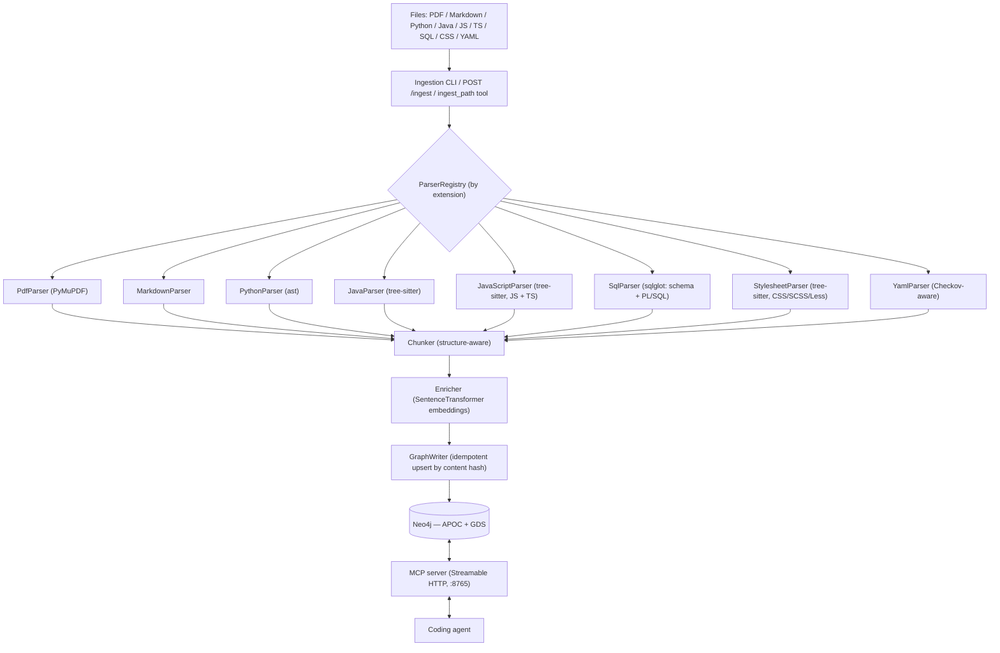

# Architecture

graph-rag ingests heterogeneous sources (PDF, Markdown, source code,
YAML/Checkov) into a single **Neo4j** knowledge graph and serves retrieval —
plus the agent's own working memory — to coding agents over an **MCP** server.
Adding a new file type — or a new source language — is a self-contained parser
plugin; nothing downstream of it changes.

Planning and roadmap live in [GitHub Issues, Milestones, and the project
board](ROADMAP.md), not in this repo.

## Overview

## Components

| Package | Responsibility |
| --- | --- |
| `graph_rag.ingest.parsers` | One `Parser` per file type. `parse(path) -> ParsedDocument` (Sections/Chunks/CodeEntities/PolicyRules). |
| `graph_rag.ingest.parser_registry` | Maps file extension → parser. New type = new module + one registration line. |
| `graph_rag.ingest.chunker` | Splits section body text into token-bounded, overlapping chunks that never cross a heading; keeps code/table blocks intact. |
| `graph_rag.ingest.embedders` | `Embedder` interface; `SentenceTransformerEmbedder` (local `all-MiniLM-L6-v2`, 384-dim) is the default — no API key, works offline. `build_embedder()` reads `GRAG_EMBEDDING_PROVIDER` and can instead return a hosted `RestEmbedder` (OpenAI / Ollama / Voyage / Cohere / Gemini — plain `httpx`, no SDKs), probing vector width against `EMBEDDING_DIMENSIONS` at startup. |
| `graph_rag.ingest.enricher` | Attaches embeddings to chunks / code entities / policy rules. |
| `graph_rag.ingestion_pipeline` | Orchestrates parse → hash-check → enrich → write. Skips unchanged files; deletes stale children of changed files. |
| `graph_rag.graph.schema` | Constraint + index DDL (`apply-schema`). Idempotent. |
| `graph_rag.graph.graph_writer` | Cypher `MERGE` upserts for every node/edge type. |
| `graph_rag.graph.centrality_analyzer` | GDS PageRank over the `CodeEntity` `CALLS`/`IMPORTS` graph → `CodeEntity.pagerank`. |
| `graph_rag.mcp_server.retriever` | Hybrid vector + full-text retrieval and graph traversal behind the MCP tools. |
| `graph_rag.mcp_server.knowledge_server` / `.memory_server` | Tool + resource definitions, one module per role; `server.py` combines both onto one server for `--role all`. |
| `graph_rag.memory` | `AgentMemory` write / recall / decay-pruning. |
| `graph_rag.cli` | `typer` CLI: `status`, `apply-schema`, `ingest`, `serve-mcp`, `compute-centrality`, `prune-memory`, `eval-retrieval`. |
| `graph_rag.http_app` | FastAPI app mounted alongside the MCP server; exposes `POST /ingest`. |

## Graph data model

**Nodes**

| Node | Key | Notable properties |
| --- | --- | --- |
| `Source` | `path` | `source_type`, `content_hash`, `ingested_at` |
| `Section` | `id` | `title`, `level`, `breadcrumb`, `order`, page range |
| `Chunk` | `id` | `text`, `token_count`, `embedding` (384-d), page/line range |
| `CodeEntity` | `qualified_name` (globally unique across every language) | `name`, `kind` (per-language vocabulary), `language`, `signature`, `docstring`, `path`, line range, `embedding`, `pagerank` |
| `PolicyRule` | `id` | `name`, `category`, `severity`, `guideline`, `embedding` |
| `Concept` | `name` | e.g. a Terraform `resource_type` |
| `AgentMemory` | `id` | `content`, `embedding`, `last_accessed_at`, access count, soft-delete flag |
| `DbTable` | `qualified_name` (`schema.table`, dialect-qualified) | `name`, `schema_name`, `embed_text`, `embedding` |
| `DbColumn` | `qualified_name` (`schema.table.column`) | `name`, `data_type`, `nullable`, `default`, `primary_key` |
| `DbView` | `qualified_name` (`schema.view`) | `name`, `schema_name`, `materialized`, `embed_text`, `embedding` |
| `DbIndex` | `qualified_name` (`schema.table.index`) | `name`, `columns`, `unique` |
| `Annotation` | `id` (hash of owner + target + fqn + line) | `name`, `fqn` (import-resolved), `target` (`type`/`method`/`constructor`/`field`/`param:<name>`), `attributes` (JSON string), `line` |

**Relationships**

- `(Source)-[:HAS_SECTION]->(Section)`, `(Section)-[:PARENT_OF]->(Section)`
- `(Section)-[:HAS_CHUNK]->(Chunk)`, `(Chunk)-[:NEXT]->(Chunk)` (reading order)
- `(Source)-[:DEFINES]->(CodeEntity)`, `(CodeEntity)-[:CONTAINS]->(CodeEntity)` (class → method)
- `(CodeEntity)-[:CALLS]->(CodeEntity)`, `(CodeEntity)-[:IMPORTS]->(CodeEntity)`
- `(CodeEntity)-[:RENDERS]->(CodeEntity)` (React `component` → child component, from the JSX it mounts)
- `(CodeEntity)-[:ANNOTATED_WITH]->(Annotation)` (Java annotations on a type / method / constructor / annotated field / parameter)
- `(Source)-[:DEFINES]->(PolicyRule)`, `(PolicyRule)-[:APPLIES_TO]->(Concept)`
- `(Source)-[:DEFINES]->(DbTable|DbColumn|DbView|DbIndex)`
- `(DbTable)-[:HAS_COLUMN]->(DbColumn)`, `(DbTable)-[:HAS_INDEX]->(DbIndex)`
- `(DbColumn)-[:REFERENCES]->(DbColumn)`, `(DbTable)-[:REFERENCES]->(DbTable)` (foreign keys)
- `(DbView)-[:DEPENDS_ON]->(DbTable|DbView)` (tables/views in the view's `SELECT`)
- `(CodeEntity)-[:READS]->(DbTable)`, `(CodeEntity)-[:WRITES]->(DbTable)` (a SQL routine's `SELECT` vs `INSERT`/`UPDATE`/`DELETE`/`MERGE`)
- `(CodeEntity)-[:ON]->(DbTable)` (the table a `trigger` fires on)
- `(Source)-[:IMPORTS]->(Source)` (stylesheet `@import` / `@use` / `@forward`)

**Indexes** (`grag-mcp apply-schema`)

- Uniqueness constraints on every node key above.
- Vector indexes (cosine, 384-d) on `Chunk`, `CodeEntity`, `PolicyRule`, `AgentMemory`, `DbTable`, `DbView` `.embedding`.
- Full-text indexes on `Chunk.text`, `Section.title`, `CodeEntity` (name/qualified_name/docstring), `PolicyRule` (id/name/category/guideline), `AgentMemory.content`, `DbTable`/`DbView` (name/qualified_name/embed_text), `Annotation` (name/fqn).
- Range indexes on `AgentMemory.last_accessed_at` and `CodeEntity.pagerank`.

## Ingestion

`grag-mcp ingest <path>` (file or directory, recursive) → `ParserRegistry`
picks a parser by extension → `Chunker` → `Enricher` (embeddings) →
`GraphWriter` upserts.

Idempotency is content-hash driven: a `Source` whose file hash is unchanged
since the last run is skipped entirely (no re-parse, no re-embed). Re-ingesting
a changed file removes any `Section` / `Chunk` / `CodeEntity` / `PolicyRule` it
no longer produces. A file that fails to parse/embed/write is recorded and
skipped without aborting the batch.

The same operation is reachable three ways: the CLI, the `ingest_path` MCP tool,
and `POST /ingest` (for CI / pre-commit hooks with no MCP client).

## Adding a language

A source-language parser is the same plugin shape as any other parser — a
class satisfying the `Parser` protocol (`can_handle(path) -> bool`,
`parse(path) -> ParsedDocument`), one module, one line in
`ParserRegistry._parsers`. What's language-specific:

- **Emit `CodeEntity`.** Set `language` on every entity. Pick a `kind`
  vocabulary that fits the language (`interface`, `enum`, `package`,
  `procedure`, …) — it's a free string, documented per parser, not an enum.
- **Namespace `qualified_name`.** It is the *single* unique key for
  `CodeEntity` across all languages, so two languages must never produce the
  same string. Python uses dotted module ancestry; a language with no global
  module namespace should prefix with its repo-relative path or a language
  tag.
- **`CALLS` / `IMPORTS` are best-effort static.** No type inference — resolve
  what's unambiguous (local definitions, explicit imports, `self`/`this`
  members) and skip the rest rather than guess, as `PythonParser` does.
- **Third-party parse backend → optional extra.** Unlike `PythonParser`
  (stdlib `ast`), other languages need a library (`tree-sitter` +
  `tree-sitter-language-pack` for Java / JS / TS / CSS; `sqlglot` for
  SQL / PL-SQL). Declare it as a `pyproject` extra (`grag-mcp[java]`, …) and
  guard the import inside `parse()` with a `RuntimeError` naming the extra,
  exactly like `PdfParser` does for `pymupdf`.

`search_code`, `get_neighbors`, and `compute-centrality` operate on
`CodeEntity` regardless of language, so a new parser needs no retrieval-side
change.

`JavaParser` (`grag-mcp[java]`, backed by `tree-sitter` +
`tree-sitter-language-pack`) is the first non-Python implementation and the
reference for the points above: `kind` is one of
`class` | `interface` | `enum` | `record` | `annotation` | `method` |
`constructor` | `field`; `qualified_name` is the package-prefixed, overload-safe
name (`com.acme.orders.OrderService.submit(Order,boolean)` — parameter types
taken verbatim from source, since there is no type resolution); plain fields are
folded into the owning type's `embed_text`, but an *annotated* field is emitted
as a `field` entity keyed `<type>#<field>` so framework wiring (`@Autowired`,
`@Value`, `@Column`) is visible; annotations on types, methods, constructors,
annotated fields, and parameters become `Annotation` nodes via
`ANNOTATED_WITH` (attribute values parsed to a JSON string; FQN resolved
against the file's imports, else the simple name); and there is no file-level
`module` entity (Java has no unit below the package), so a file's `imports`
attach to its first top-level type.

`JavaScriptParser` (`grag-mcp[js]`, same backend) handles JavaScript,
TypeScript, and their JSX variants in one parser
(`.js` `.mjs` `.cjs` `.jsx` `.ts` `.tsx`) — TS and JSX are grammar variants of
the same parse, not separate parsers. Unlike Java it *does* emit a file-level
`module` entity (`qualified_name` is the project-relative path — nearest
`package.json` / `tsconfig.json` ancestor — dotted and extension-stripped, with
`index` collapsed to its directory), and the module carries the `imports`.
`kind` is `module` | `function` | `class` | `method` | `constructor` |
`interface` | `type` | `enum`; exported arrow/function `const`s become
`function` entities; TS `interface` / `type` / `enum` are signature-only (no
members-as-entities). Relative import specifiers (`./`, `../`) resolve against
the project tree to the same dotted form (named imports as `module.symbol`,
like Python's `from x import y`); bare specifiers (`react`, `lodash`) are kept
verbatim. `imports` covers ESM (`import`, `export … from`, `export *`, dynamic
`import()`) and CommonJS (`require`).

`ReactEnricher` is a second pass `JavaScriptParser` runs on `.jsx` / `.tsx`
files (and `.js` / `.ts` that import `react`): a `function` / `class` entity
that returns JSX or extends `React.Component` is retagged `kind="component"`,
each PascalCase JSX element it mounts that resolves (local def or import)
becomes a `(component)-[:RENDERS]->(component)` edge, and the hook calls
(`useX`) and prop names (first-arg destructuring or `props.` accesses) it uses
are folded into `embed_text` / `signature` so `search_code` can match them.
Unresolved and lowercase (`div`) tags are skipped, like `calls`. Prop *types*
and lifecycle call graphs are out of scope.

`SqlParser` (`grag-mcp[sql]`, backed by `sqlglot`) covers both **schema** and
**procedural** SQL from one file. `CREATE TABLE` / column /
`CREATE VIEW` (incl. materialized) / `CREATE INDEX` become `:DbTable` /
`:DbColumn` / `:DbView` / `:DbIndex` nodes keyed by dialect-qualified
`qualified_name` (`schema.table`, `schema.table.column`,
`schema.table.index`). Foreign keys (inline, table-level, and `ALTER TABLE …
ADD CONSTRAINT`) become `REFERENCES` edges at both column and table level; a
view's `SELECT` yields `DEPENDS_ON` edges to the tables/views it reads (CTE
names excluded); each table owns its columns via `HAS_COLUMN` and its indexes
via `HAS_INDEX`. An `ALTER` whose target table lives in another migration file
is carried as a standalone reference so the edge still lands once that table is
ingested. Dialect is `settings.sql_dialect` (env `GRAG_SQL_DIALECT`;
`postgres` / `mysql` / `tsql` / `oracle` / `snowflake` / `bigquery`, default
generic), overridable per file with a `-- grag:dialect=<name>` marker comment;
an unknown dialect or an unparseable file logs a warning and yields a `Source`
with no schema nodes. Tables and views are embedded (a rendered `CREATE TABLE
…` / view summary); wiring them into `search_code` (or a dedicated
`search_schema`) is a follow-up — the vector/full-text indexes are already
created.

`ProceduralSqlExtractor` (run by `SqlParser` on the same file, also for the
`.pks` / `.pkb` / `.prc` / `.fnc` / `.trg` / `.plsql` extensions) turns stored
procedures, functions, packages, and triggers into `CodeEntity` nodes —
`kind` ∈ `package` | `package_body` | `procedure` | `function` | `trigger`,
`qualified_name` = `schema.package.routine` (packaged, `parent_qualified_name`
= the package) or `schema.routine`. `sqlglot` handles T-SQL `CREATE PROCEDURE`
bodies as an AST; PL/pgSQL `$$…$$` bodies and all of Oracle PL/SQL
(packages, triggers, `RETURN` in a spec) are parsed by a delimiter-scoped
**regex sweep** — so the accuracy ceiling is dialect-dependent (see
`docs/operations.md`). A routine whose body can't be analyzed still yields its
header entity, with a logged warning. Best-effort `CALLS` links routines
(bare `proc(...)` resolved only when unambiguous, `pkg.proc(...)` when the
package is known); `READS` / `WRITES` link a routine to the `:DbTable`s its
body selects from / writes to, and `ON` links a `trigger` to its table.

`StylesheetParser` (`grag-mcp[css]`, tree-sitter `css` / `scss` / `less`
grammars — `.css` `.scss` `.sass` `.less`) is a **prose-shape** parser: no
`CodeEntity` (CSS has no call graph), just a `Section` per file (plus one per
top-level `@media` / `@supports`) and a `Chunk` per rule, so the plain
`search` tool covers stylesheet content. SCSS nesting is flattened into full
selector paths (`.card .title`, `.card:hover`); custom properties (`--x`),
`$variables`, and `@mixin`s each also get their own name-bearing chunk.
`@import` / `@use` / `@forward` resolve against the file tree to
`(Source)-[:IMPORTS]->(Source)` edges (Sass built-ins like `sass:math` and
remote URLs skipped). `.sass` indented syntax and constructs the grammar
version doesn't cover (`@extend`, some `@include` forms) degrade to a partial
result with a logged warning.

## Retrieval

`search` / `search_code` / `search_policies` run **hybrid retrieval**: a vector
similarity query fetches the candidate set (`top_k * multiplier`), and a
full-text query over the same corpus contributes a boost, score-fused as
`0.7 * vector + 0.3 * full-text` after min-max normalization (see
`retriever.combine_scores`), then truncated to `top_k`.

The vector query defines the candidate set: full-text only re-weights ids the
vector search already surfaced. A hit that full-text alone would find but the
bi-encoder ranks outside `top_k * multiplier` is not recovered — and, since the
reranker also sees only that shortlist, not recovered by reranking either.

Setting `GRAG_RERANK=1` inserts a cross-encoder pass between fusion and
truncation: `CrossEncoderReranker` re-scores the fused shortlist by reading the
query and each candidate together (`retriever._maybe_rerank`) and reorders by
that score, with the fused score breaking ties. Each hit then carries both
`score` (the fused value, unchanged) and `rerank_score` (the raw logit). Off by
default; the model must resolve to a local copy (`GRAG_RERANK_MODEL` env →
mounted image dir → `models/` in a checkout) or construction fails at startup —
it is not baked into the image and there is no implicit Hub download. See the
README "Reranking" section for the before/after eval numbers.

Setting `GRAG_QUERY_REWRITE=1` adds a stage on the other side of retrieval —
*before* the candidate set is formed. A `QueryRewriter` turns the query into up
to `GRAG_QUERY_REWRITE_MAX_QUERIES` variants (`HeuristicQueryRewriter`, an
offline acronym/split expander, by default; `LlmQueryRewriter` against an
OpenAI-compatible endpoint when `GRAG_QUERY_REWRITE_MODEL` is set), each search
method runs the full vector+full-text pass per variant, and
`retriever._merge_keeping_max` folds the per-variant fused scores into one
best-score-per-id map that then feeds the reranker/truncation stage unchanged.
A rewriter never raises: any backend failure degrades to the single original
query. Off by default; wired only for the `knowledge`/`all` roles.

Graph-native tools sit alongside search: `get_section` / `get_outline`
(hierarchy walk), `get_neighbors` (traverse from any node), `find_policies_for`
(exact `APPLIES_TO` traversal), `get_central_code_entities` (PageRank order),
`cite` (citation string), `list_sources`.

## MCP server

`grag-mcp serve-mcp` runs over **Streamable HTTP** by default — a long-lived
process (its own compose service) so the embedding model and the Neo4j driver
pool stay warm across agent sessions. `--stdio` switches to the stdio transport
for clients that spawn the server per session; it shares the same tool wiring
but skips the HTTP app, the `POST /ingest` route, and the auth-token gate.

`--role knowledge|memory|all` (default `all`) selects which tools that wiring
exposes: `all` is `build_server` in `mcp_server/server.py`, one server with
every tool, unchanged from before `--role` existed. `knowledge` and `memory`
are `build_knowledge_server`/`build_memory_server` — each a standalone server
with only its half of the tools, meant to run as an independent process
against its own Neo4j. `POST /ingest` (a knowledge concern) is only mounted
when an `IngestionPipeline` exists, i.e. for `knowledge`/`all`. All three
roles share the same tool implementations (`register_knowledge_tools`/
`register_memory_tools`), so there is exactly one copy of each tool's body
regardless of which server(s) it ends up registered on.

Security posture of the HTTP transport (see [SECURITY.md](../SECURITY.md)):

- Binds `127.0.0.1` by default; `docker-compose.yml` publishes on loopback only.
- Origin / DNS-rebinding protection is always on (`TransportSecuritySettings` in
  `cli.py`), even when `MCP_HOST=0.0.0.0` inside a container.
- Optional `MCP_AUTH_TOKEN` bearer check as defense in depth.

stdio has no network surface — the client owns the process's stdin/stdout — so
those controls don't apply.

## Agent memory

`remember` / `recall` / `forget` store `AgentMemory` nodes (embedded, so
`recall` is semantic; ranked by relevance plus an `importance` and a
recency/frequency boost). `grag-mcp prune-memory` (no args needed) soft-deletes
memories whose decay score `(1 + access_count) * exp(-days_since_last_recall/30)`
falls below a threshold and hard-deletes ones past a grace window; schedule it
per `docs/operations.md`.

`remember(about_qualified_name=...)` links a memory to a `CodeEntity` two
ways: `about_qualified_name` is always stored as a plain property on
`AgentMemory` — the source of truth `recall`'s `about_qualified_name` filter
matches against — and, best-effort, an `(:AgentMemory)-[:ABOUT]->(:CodeEntity)`
edge is also merged when a `CodeEntity` with that `qualified_name` exists in
this database. The edge is what `get_neighbors` walks to answer "what's been
remembered about this function" from the code side; it only forms when
agent memory and the knowledge base share one database. The property is what
makes `recall(about_qualified_name=...)` correct either way, including a
memory-only deployment with no `CodeEntity` nodes at all.

## Deployment

- **Local:** `make up` (Neo4j) + `make mcp-serve`, or `docker compose up -d` for
  both.
- **Image:** multi-stage `Dockerfile` — the app venv is built against a
  standalone CPython and copied into `gcr.io/distroless/cc-debian13:nonroot`
  (no shell, no package manager, non-root). Every base image (`BUILDER_IMAGE`,
  `RUNTIME_IMAGE`, `UV_IMAGE`, `NEO4J_IMAGE`) is overridable for environments
  restricted to an approved hardened registry — see
  [operations.md](operations.md#restricted--hardened-registry-environments).
  Three build targets share one `builder-base`/lockfile: the untargeted
  default (`serve-mcp`, no `--role` — what `docker-compose.yml` builds) and
  `knowledge` both install `[pdf]` and are content-identical, differing only
  in `CMD`; `memory` installs the bare package (no parser stack, no
  `pymupdf`) and pins `--role memory`.
- **Neo4j:** Community edition with the APOC and Graph Data Science plugins
  (GDS is only needed for `compute-centrality`).
- **Split deployment (optional):** `docker-compose.knowledge.yml` /
  `docker-compose.memory.yml` run the `knowledge`/`memory` images against
  their own Neo4j each, instead of the combined `docker-compose.yml` stack —
  see [operations.md](operations.md#split-deployment-optional).

Backup/restore and day-2 operations: [operations.md](operations.md).
