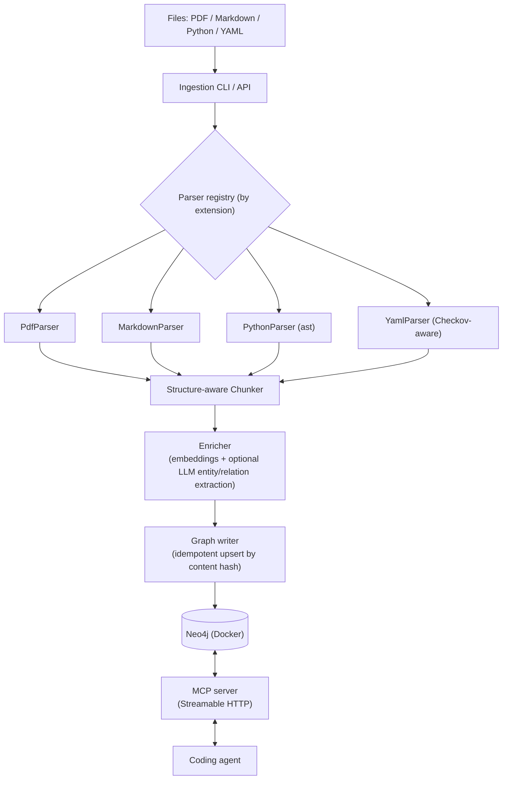
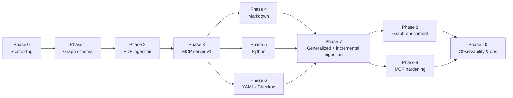
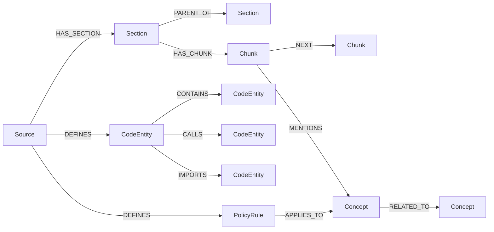
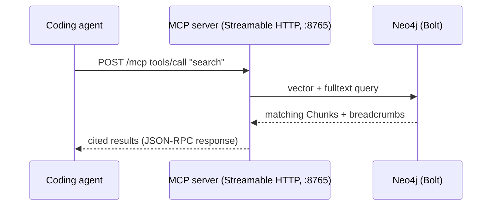

# Graph RAG for Coding Agents — Implementation Plan

## Goal

A local-first Graph RAG system that ingests heterogeneous documents (AWS
service docs as PDF today; internal Markdown, Python, and YAML/YML —
e.g. Checkov policies — soon), stores them as a knowledge graph in Neo4j,
and exposes lookup to coding agents via an MCP server. Adding a new file
or a whole new file type must be a small, isolated change (new parser
plugin), not a rewrite.

## Assumptions / defaults (flag if you want different choices)

- **Language/runtime**: Python 3.12, managed with `uv`.
- **Graph DB**: Neo4j 5.x Community, via Docker, with APOC + native
  vector index (no separate vector DB needed — Neo4j 5.13+ supports
  `db.index.vector` natively, so graph traversal and semantic search
  live in one store).
- **Embeddings**: pluggable `Embedder` interface; default to a local
  model (`sentence-transformers`, e.g. `BAAI/bge-small-en-v1.5`) so
  ingestion works fully offline with no API key. Swappable for
  Voyage/OpenAI/Anthropic-hosted embeddings later via config.
- **MCP transport**: Streamable HTTP (the current MCP spec's HTTP
  transport), served as a long-lived process alongside Neo4j — see
  the security notes in Phase 3 for the localhost-binding /
  origin-check / optional bearer-token measures that come with
  choosing HTTP over stdio.
- **PDF parsing**: PyMuPDF (`fitz`) for text+layout extraction, using
  font-size/style heuristics plus the embedded TOC/outline (this PDF
  has one — confirmed from the AWS doc's table of contents) to
  reconstruct heading hierarchy.

---

## Architecture overview



## Phase roadmap



Phases 0–3 are the critical path (agent can already query the DMS
guide). 4–6 fan out independently once the parser-plugin contract is
proven. 7 unlocks cheap addition of further file types. 8–10 are
quality/scale layers on a working system.

---

## Phase 0 — Project & environment scaffolding

- `uv init`, project layout:
  ```
  graph_rag/
    ingest/          # parsers, chunkers, pipeline
    graph/           # schema, Neo4j client, upsert logic
    mcp_server/       # MCP tool definitions
    cli.py
  docker-compose.yml  # neo4j service
  training-docs/       # existing PDF stays here as sample input
  ```
- `docker-compose.yml`: Neo4j 5.x image, APOC plugin enabled, volumes
  for `data`/`plugins`, exposed bolt (7687) + browser (7474) ports,
  `.env` for `NEO4J_AUTH`. A second service, `mcp-server`, is added
  in Phase 3 once it exists — built from this repo's Dockerfile,
  depends on `neo4j`, publishes `127.0.0.1:8765:8765` (loopback-only,
  see Phase 3 security notes).
- `.env.example`, `pyproject.toml` with dependency groups
  (`pdf`, `dev`), Makefile/justfile for `up`, `ingest`, `mcp-serve`.
- Basic `pytest` setup and a `ruff`/`black` config.

**Exit criteria**: `docker compose up -d neo4j` gives a running,
empty graph reachable via `bolt://localhost:7687`.

---

## Phase 1 — Graph schema & data model

Design the node/relationship taxonomy up front so every parser plugin
writes into the same shape.

**Core nodes**
- `Source` — one per ingested file (path, type, content hash, ingested_at, version)
- `Section` — hierarchical heading node (title, level, breadcrumb, order) — used by PDF/Markdown
- `Chunk` — atomic retrievable unit (text, token_count, embedding vector, source ref, page/line range)
- `CodeEntity` — Python module/class/function (name, signature, docstring, file, line range)
- `PolicyRule` — Checkov policy (id, resource_types, category, severity, description)
- `Concept` — optional LLM-extracted entity/term for cross-document linking

**Core relationships**
- `(Source)-[:HAS_SECTION]->(Section)`, `(Section)-[:PARENT_OF]->(Section)` (hierarchy)
- `(Section)-[:HAS_CHUNK]->(Chunk)`, `(Chunk)-[:NEXT]->(Chunk)` (reading order)
- `(Source)-[:DEFINES]->(CodeEntity)`, `(CodeEntity)-[:CALLS]->(CodeEntity)`, `(CodeEntity)-[:IMPORTS]->(CodeEntity)`
- `(PolicyRule)-[:APPLIES_TO]->(Concept {type:"resource_type"})`
- `(Chunk)-[:MENTIONS]->(Concept)`, `(Concept)-[:RELATED_TO]->(Concept)`



**Constraints/indexes**
- Uniqueness on `Source.path`, `Chunk.id`, `CodeEntity.qualified_name`, `PolicyRule.id`
- Vector index on `Chunk.embedding` (cosine similarity)
- Full-text index on `Chunk.text` / `Section.title` for hybrid keyword+vector search

**Deliverable**: `graph/schema.py` (constraint/index DDL run on startup) + a short schema doc with the diagram above.

---

## Phase 2 — PDF ingestion (first real pipeline, using `dms-ug.pdf`)

- `PdfParser`: use PyMuPDF's TOC/outline API to get the heading tree
  directly (AWS doc ships one — saw "Table of Contents" spanning
  pages iii–xxv in the sample). Fall back to font-size heuristics for
  PDFs without an embedded outline.
- Walk the outline to build `Section` nodes with correct
  parent/child nesting (e.g. *Converting database schemas* →
  *Concepts* → *Selection rules*), attaching page ranges.
- `Chunker`: within each leaf section, split body text into
  token-bounded chunks (~300–500 tokens, ~15% overlap), never
  crossing a heading boundary; keep table/code-like blocks intact
  where detectable.
- `content_hash` per `Source` (file hash) and per `Chunk` (text hash)
  for idempotent re-ingestion — re-running ingest on an unchanged PDF
  is a no-op; a changed PDF diffs at the section level.
- Embedding generation + upsert into Neo4j.
- CLI: `graph-rag ingest training-docs/dms-ug.pdf`

**Exit criteria**: full DMS guide ingested; a Cypher query can walk
from the `Source` down to a `Chunk` inside "Selection rules" and
back up its breadcrumb; a vector-similarity query returns relevant
chunks for a natural-language question about DMS.

---

## Phase 3 — MCP server, v1 (read-only retrieval, HTTP transport)

- Use the official Python MCP SDK (`mcp`/FastMCP), served via
  **Streamable HTTP** (`mcp.server.fastmcp` mounted on
  Starlette/uvicorn) rather than stdio — runs as a long-lived process
  (its own `docker-compose` service, alongside `neo4j`) so the
  embedding model and Neo4j driver connection pool stay warm across
  requests instead of reloading per agent session.
- Tool: `search(query: str, top_k: int, filters?: {source_type, source_path})`
  → hybrid retrieval: vector similarity on `Chunk.embedding` + optional
  full-text boost, returns chunk text + breadcrumb + source citation.
- Tool: `get_section(section_id)` → full section text + child/parent
  outline, for when the agent wants more surrounding context than one
  chunk.
- Tool: `list_sources()` → what's currently ingested (path, type,
  ingested_at) so the agent knows what it can ask about.
- Register the server in the coding agent's MCP config (`.mcp.json`)
  as an HTTP entry, e.g. `{"type": "http", "url": "http://127.0.0.1:8765/mcp"}`.

**HTTP transport — security notes**
- Bind the server to `127.0.0.1` by default, not `0.0.0.0`; only widen
  this deliberately if remote access is actually needed later.
- Validate the `Origin` header on incoming requests (FastMCP supports
  this) — mitigates DNS-rebinding attacks where a malicious webpage
  in a browser on the same machine tries to hit the local MCP port.
- Add an optional bearer-token env var (`MCP_AUTH_TOKEN`) checked on
  each request — cheap defense in depth even for localhost-only use,
  and becomes mandatory if the bind address is ever widened beyond
  loopback.
- No CORS relaxation needed since the client is the coding agent, not
  a browser.



**Exit criteria**: from Claude Code (or another MCP client) with the
server registered as an HTTP endpoint, calling
`search("how do I create a replication instance")` returns grounded,
cited chunks from the DMS guide.

---

## Phase 4 — Markdown ingestion

- `MarkdownParser`: parse frontmatter (if present), build `Section`
  tree from heading levels (`#`..`######`), preserve fenced code
  blocks as atomic chunks (never split mid-block), extract links as
  candidate `REFERENCES` edges to other `Source`/`Section` nodes when
  resolvable.
- Reuses the same `Chunker`/embed/upsert pipeline from Phase 2 — this
  phase mainly proves the parser-plugin boundary is real (no changes
  needed downstream of `Section`/`Chunk` emission).

**Exit criteria**: ingest a sample `.md` file; graph shape matches
PDF-derived sections; `search()` returns Markdown-sourced chunks
alongside PDF ones, correctly attributed.

---

## Phase 5 — Python ingestion

- `PythonParser`: use `ast` to extract modules, classes, functions,
  and their docstrings/signatures as `CodeEntity` nodes (not generic
  `Chunk`s — code wants structural, not prose, chunking).
- Build `IMPORTS` edges from `import`/`from ... import` statements
  and `CALLS` edges from a lightweight call-site walk within each
  function body (best-effort, static — no type resolution needed for
  v1).
- Docstrings become the primary embedded text per `CodeEntity` (falls
  back to a signature+first-line-of-body summary if no docstring).
- Decide chunk granularity: function/method as the atomic unit; class
  gets its own node with a `CONTAINS` edge to its methods; module
  gets a top-level node summarizing exports.

**Exit criteria**: ingest this project's own `graph_rag/` package;
query "what does the PdfParser do" returns the right function/class
node with its docstring and file:line location.

---

## Phase 6 — YAML/YML ingestion (Checkov policies)

- `YamlParser` with a Checkov-specific mode: recognize the custom
  policy schema (`metadata.id`, `metadata.guideline`,
  `scope.provider`, `definition`), emit one `PolicyRule` node per
  policy file (or per policy if a file holds multiple).
- Link `PolicyRule` → `Concept(resource_type)` via `APPLIES_TO` so a
  query like "what policies apply to `aws_db_instance`" is a graph
  traversal, not a text search.
- Generic (non-Checkov) YAML falls back to structural chunking by
  top-level key, still parsed and embedded, just without the
  policy-specific edges.

**Exit criteria**: ingest a sample Checkov policy directory;
`search()` and a new `find_policies_for(resource_type)` MCP tool both
work.

---

## Phase 7 — Generalized ingestion API & incremental updates

- Formalize the parser plugin interface (`Parser.can_handle(path)`,
  `Parser.parse(path) -> ParsedDocument`) and a registry so adding a
  new file type is: write a parser, register the extension, done —
  no changes to chunker/enricher/writer contracts.
- `graph-rag ingest <path>` becomes: file or directory (recursive),
  `--watch` optional for continuous local dev, `--dry-run` to preview
  the graph diff before writing.
- Change detection: content-hash comparison at `Source` and `Chunk`
  level drives upsert-vs-skip-vs-delete-stale-children logic (needed
  once Python/YAML/Markdown files in a real repo start changing
  often, unlike the static PDF).
- Expose the same operation as an MCP tool (`ingest_path`) *and* as a
  small FastAPI endpoint (`POST /ingest`), gated behind local-only
  binding — so it's usable from CI or a pre-commit hook, not just the
  CLI.

**Exit criteria**: editing one function's docstring and re-running
ingest updates only that `CodeEntity` node, not the whole repo.

---

## Phase 8 — Graph enrichment (cross-document linking)

- Optional LLM pass (batched, cached by chunk hash) to extract
  `Concept` entities from prose chunks and link related concepts
  across sources — e.g. a DMS doc chunk about "endpoints" links to a
  Checkov policy that scopes `aws_dms_endpoint`.
- Run Neo4j GDS (or APOC) algorithms (PageRank / community detection)
  over `Concept`/`Section` to support "what's most central to X"
  style queries and to help rank `search()` results beyond pure
  vector similarity.

**Exit criteria**: a query that only makes sense as a graph
traversal (e.g. "which Checkov policies relate to features described
in the DMS replication instance section") returns a correct,
non-trivial answer.

---

## Phase 9 — MCP API hardening & agent ergonomics

- Round out tool set: `get_neighbors(node_id, rel_types?)`,
  `get_outline(source_path)`, `cite(chunk_id)` (returns a
  human-readable citation string), `ingest_path` (from Phase 7).
- Return shapes optimized for LLM consumption (concise, cited,
  token-budget aware — truncate/paginate large sections).
- Add resource templates (MCP `resources/`) for browsing the source
  list without a tool call.

---

## Phase 10 — Observability, evaluation, ops

- `IngestionRun` tracking (start/end, files processed, errors) as
  either graph nodes or structured logs.
- Small retrieval eval set: hand-written questions with expected
  source/section, run against `search()` to catch regressions when
  chunking logic changes.
- Backup/restore docs for the Neo4j volume; `docker compose down -v`
  safety notes.
- README covering: setup, `docker compose up`, `graph-rag ingest`,
  registering the MCP server with the coding agent.

